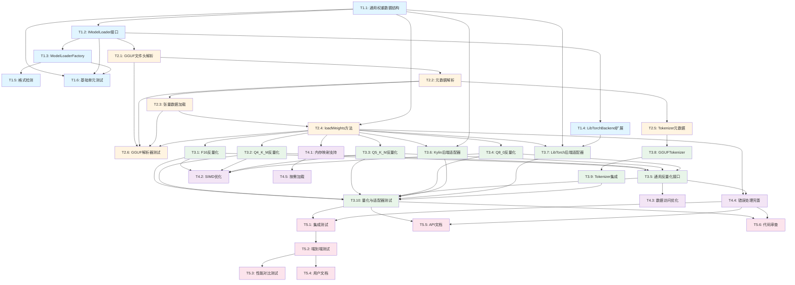

# GGUF 格式支持功能任务分解文档

## 文档信息
- **创建日期**: 2026-01-13
- **基于文档**: `docs/design/GGUF格式支持详细设计.md`
- **版本**: v1.0
- **状态**: 任务分解完成

---

## 1. 阶段划分总览

根据 GGUF 格式支持详细设计文档，将整体开发工作划分为 **5 个主要阶段**，预计总工期 **10-14 周**。

### 阶段概览

| 阶段 | 名称 | 工期 | 关键交付物 | 前置条件 |
|------|------|------|-----------|---------|
| **阶段1** | 基础架构搭建 | 2-3周 | 通用权重数据结构、工厂接口、格式检测 | 设计文档完成 |
| **阶段2** | GGUF 解析器实现 | 3-4周 | GGUF 文件解析、元数据提取、张量加载 | 阶段1完成 |
| **阶段3** | 量化支持与后端适配 | 3-4周 | 反量化算法、后端适配器、Tokenizer集成 | 阶段2完成 |
| **阶段4** | 优化与完善 | 2-3周 | 内存映射、性能优化、错误处理 | 阶段3完成 |
| **阶段5** | 测试与文档 | 1-2周 | 测试用例、性能报告、用户文档 | 阶段4完成 |

---

## 2. 阶段详细说明

### 阶段1: 基础架构搭建 (2-3周)

#### 2.1.1 阶段目标
建立后端无关的模型加载架构，实现通用权重数据结构和工厂模式接口，为后续 GGUF 格式支持奠定基础。

#### 2.1.2 目标范围
- 实现通用权重数据结构 (`ModelWeights`, `WeightData`, `LayerWeights`)
- 实现 `IModelLoader` 接口（后端无关）
- 实现 `ModelLoaderFactory` 工厂类
- 扩展 `LibTorchBackend` 添加 GGUF 支持接口
- 实现格式检测逻辑
- 编写基础单元测试

#### 2.1.3 前置条件
- ✅ 设计文档已完成并审核通过
- ✅ 开发环境已配置（CMake、编译器、依赖库）
- ✅ 现有代码库可正常编译运行

#### 2.1.4 预期成果
- 通用权重数据结构已实现并通过测试
- `IModelLoader` 接口定义完成，支持 `loadWeights()` 方法
- `ModelLoaderFactory` 可以检测格式并创建加载器
- `LibTorchBackend` 扩展接口已定义
- 基础单元测试覆盖率达到 80%+

---

### 阶段2: GGUF 解析器实现 (3-4周)

#### 2.2.1 阶段目标
实现完整的 GGUF 文件解析功能，包括文件头解析、元数据提取、张量数据加载，支持 GGUF 格式规范 v3。

#### 2.2.2 目标范围
- 实现 `GGUFLoader` 类
- 实现 GGUF 文件头解析 (`parseHeader()`)
- 实现元数据解析 (`parseMetadata()`)
- 实现张量数据加载 (`parseTensorData()`)
- 实现 `loadWeights()` 方法，返回 `ModelWeights`
- 实现 Tokenizer 元数据加载
- 编写 GGUF 解析器单元测试

#### 2.2.3 前置条件
- ✅ 阶段1完成：通用权重数据结构可用
- ✅ 阶段1完成：`IModelLoader` 接口已定义
- ✅ 有可用的 GGUF 测试文件（至少包含 F32 格式）

#### 2.2.4 预期成果
- `GGUFLoader` 可以正确解析 GGUF 文件头
- 可以提取所有元数据（模型配置、架构参数等）
- 可以加载张量数据到 `ModelWeights` 结构
- 支持 GGUF 格式规范 v3
- 单元测试覆盖所有解析功能

---

### 阶段3: 量化支持与后端适配 (3-4周)

#### 2.3.1 阶段目标
实现多种量化类型的反量化算法，完成后端适配器实现，集成 Tokenizer 支持。

#### 2.3.2 目标范围
- 实现量化反量化算法（Q4_K_M, Q5_K_M, Q8_0, F16, INT8 等）
- 实现 Kylin 后端适配器 (`loadFromModelWeights()`)
- 实现 LibTorch 后端适配器 (`loadFromModelWeights()`)
- 实现 `GGUFTokenizer` 类
- 集成到现有 Tokenizer 系统
- 编写量化算法和后端适配器测试

#### 2.3.3 前置条件
- ✅ 阶段2完成：GGUF 解析器可以加载权重数据
- ✅ 阶段2完成：`ModelWeights` 结构可以正确填充
- ✅ 有不同量化格式的 GGUF 测试文件

#### 2.3.4 预期成果
- 支持至少 5 种量化类型的反量化（Q4_K_M, Q5_K_M, Q8_0, F16, F32）
- Kylin 后端可以正确加载 GGUF 模型
- LibTorch 后端可以正确加载 GGUF 模型
- Tokenizer 可以从 GGUF 文件加载
- 所有量化类型都有对应的测试用例

---

### 阶段4: 优化与完善 (2-3周)

#### 2.4.1 阶段目标
优化性能，实现内存映射支持，完善错误处理，提升系统稳定性和性能。

#### 2.4.2 目标范围
- 实现内存映射支持（mmap/CreateFileMapping）
- SIMD 优化反量化算法
- 优化数据访问模式（缓存友好）
- 完善错误处理和异常安全
- 实现按需加载机制
- 性能测试和优化

#### 2.4.3 前置条件
- ✅ 阶段3完成：基本功能已实现
- ✅ 阶段3完成：所有测试用例通过
- ✅ 有性能测试基准

#### 2.4.4 预期成果
- 内存映射功能已实现并测试
- 反量化性能提升 2-3 倍（通过 SIMD 优化）
- 错误处理完善，所有异常情况都有明确错误信息
- 性能测试报告完成
- 内存占用优化 20%+

---

### 阶段5: 测试与文档 (1-2周)

#### 2.5.1 阶段目标
完成全面测试，编写用户文档和开发者文档，确保功能完整性和可用性。

#### 2.5.2 目标范围
- 编写集成测试用例
- 编写端到端测试用例
- 性能对比测试（GGUF vs Binary vs Safetensors）
- 编写用户使用文档
- 编写开发者 API 文档
- 代码审查和重构

#### 2.5.3 前置条件
- ✅ 阶段4完成：所有功能已实现
- ✅ 阶段4完成：性能优化已完成

#### 2.5.4 预期成果
- 测试覆盖率达到 90%+
- 集成测试全部通过
- 性能测试报告完成
- 用户文档完整
- API 文档完整
- 代码质量达标

---

## 3. 详细任务清单

### 阶段1: 基础架构搭建

#### 任务1.1: 实现通用权重数据结构
- **任务ID**: T1.1
- **执行内容**:
  - 创建 `include/cllm/model/weight_data.h`
  - 实现 `WeightData` 结构体
  - 实现 `LayerWeights` 结构体
  - 实现 `ModelWeights` 结构体
  - 实现辅助方法（`findWeight()`, `getAllWeights()`, `isValid()`）
- **技术要求**:
  - 使用标准 C++17
  - 遵循项目编码规范
  - 包含完整的 Doxygen 注释
- **交付标准**:
  - 头文件通过编译
  - 所有方法有单元测试
  - 代码审查通过
- **负责人角色**: C++ 开发工程师
- **预估工时**: 2 天
- **依赖关系**: 无

#### 任务1.2: 实现 IModelLoader 接口
- **任务ID**: T1.2
- **执行内容**:
  - 创建 `include/cllm/model/loader_interface.h`
  - 定义 `IModelLoader` 抽象基类
  - 实现 `loadWeights(ModelWeights&)` 纯虚方法
  - 实现 `loadInto()` 便捷方法（默认实现）
  - 实现 `loadToTorchTensorDict()` 便捷方法（条件编译）
  - 实现转换辅助方法（`convertToKylinTensors()`, `convertToTorchTensors()`）
- **技术要求**:
  - 使用虚函数实现多态
  - 支持条件编译（`#ifdef ENABLE_LIBTORCH_BACKEND`）
  - 异常安全保证
- **交付标准**:
  - 接口定义完整
  - 编译通过
  - 有接口使用示例
- **负责人角色**: C++ 架构师
- **预估工时**: 3 天
- **依赖关系**: T1.1

#### 任务1.3: 实现 ModelLoaderFactory 工厂类
- **任务ID**: T1.3
- **执行内容**:
  - 创建 `include/cllm/model/loader_factory.h`
  - 创建 `src/model/loader_factory.cpp`
  - 实现 `ModelFormat` 枚举
  - 实现 `detectFormat()` 方法
  - 实现 `createLoader()` 工厂方法
  - 实现各格式的创建方法（`createBinaryLoader()`, `createGGUFLoader()`, `createSafetensorsLoader()`）
  - 实现 `isFormatSupported()` 方法
- **技术要求**:
  - 使用工厂模式
  - 支持运行时格式检测
  - 支持条件编译
- **交付标准**:
  - 可以正确检测文件格式
  - 可以创建对应的加载器实例
  - 有单元测试覆盖
- **负责人角色**: C++ 开发工程师
- **预估工时**: 2 天
- **依赖关系**: T1.2

#### 任务1.4: 扩展 LibTorchBackend 接口
- **任务ID**: T1.4
- **执行内容**:
  - 修改 `include/cllm/inference/libtorch_backend.h`
  - 添加 `loadWeightsFromDict()` 方法声明
  - 添加 `loadFromGGUF()` 方法声明
  - 添加 `buildModel()` 私有方法声明
  - 更新类文档说明
- **技术要求**:
  - 保持向后兼容
  - 使用条件编译保护
- **交付标准**:
  - 接口定义完整
  - 编译通过
  - 文档更新
- **负责人角色**: C++ 开发工程师
- **预估工时**: 1 天
- **依赖关系**: T1.2

#### 任务1.5: 实现格式检测逻辑
- **任务ID**: T1.5
- **执行内容**:
  - 在 `ModelLoaderFactory` 中实现文件扩展名检测
  - 实现文件魔数检测（可选，用于更准确的格式识别）
  - 处理边界情况（文件不存在、权限不足等）
- **技术要求**:
  - 支持 `.gguf`, `.bin`, `.safetensors` 扩展名
  - 错误处理完善
- **交付标准**:
  - 格式检测准确率 100%
  - 有单元测试
- **负责人角色**: C++ 开发工程师
- **预估工时**: 1 天
- **依赖关系**: T1.3

#### 任务1.6: 编写基础单元测试
- **任务ID**: T1.6
- **执行内容**:
  - 创建 `tests/test_weight_data.cpp`
  - 创建 `tests/test_loader_factory.cpp`
  - 编写 `WeightData` 测试用例
  - 编写 `ModelWeights` 测试用例
  - 编写 `ModelLoaderFactory` 测试用例
- **技术要求**:
  - 使用 Google Test 框架
  - 测试覆盖率达到 80%+
- **交付标准**:
  - 所有测试用例通过
  - 测试覆盖率报告
- **负责人角色**: 测试工程师
- **预估工时**: 2 天
- **依赖关系**: T1.1, T1.2, T1.3

---

### 阶段2: GGUF 解析器实现

#### 任务2.1: 实现 GGUF 文件头解析
- **任务ID**: T2.1
- **执行内容**:
  - 创建 `include/cllm/model/gguf_loader.h`
  - 创建 `src/model/gguf_loader.cpp`
  - 定义 `GGUFHeader` 结构体
  - 实现 `parseHeader()` 方法
  - 验证魔数 (`0x46554747`)
  - 验证版本号（支持 v3）
  - 读取张量数量和元数据数量
- **技术要求**:
  - 处理字节序（小端/大端）
  - 错误处理完善
  - 支持 GGUF v3 格式
- **交付标准**:
  - 可以正确解析文件头
  - 有单元测试
  - 错误情况处理正确
- **负责人角色**: C++ 开发工程师
- **预估工时**: 2 天
- **依赖关系**: T1.2

#### 任务2.2: 实现元数据解析
- **任务ID**: T2.2
- **执行内容**:
  - 定义 `GGUFMetadata` 结构体
  - 实现 `parseMetadata()` 方法
  - 解析模型配置参数（hiddenSize, numLayers, vocabSize 等）
  - 解析架构特定参数（ropeTheta, rmsNormEps 等）
  - 解析量化参数
  - 构建元数据键值对映射
- **技术要求**:
  - 支持字符串、整数、浮点数、布尔值类型
  - 处理数组类型
  - 错误处理完善
- **交付标准**:
  - 可以正确解析所有元数据
  - 有单元测试覆盖所有数据类型
- **负责人角色**: C++ 开发工程师
- **预估工时**: 3 天
- **依赖关系**: T2.1

#### 任务2.3: 实现张量数据加载
- **任务ID**: T2.3
- **执行内容**:
  - 实现 `parseTensorData()` 方法
  - 读取张量信息表
  - 解析张量名称、形状、类型
  - 记录张量数据偏移量
  - 构建张量名称到偏移量的映射
- **技术要求**:
  - 支持所有 GGUF 数据类型
  - 处理对齐要求
  - 内存映射支持（可选）
- **交付标准**:
  - 可以正确解析张量信息
  - 偏移量计算正确
  - 有单元测试
- **负责人角色**: C++ 开发工程师
- **预估工时**: 3 天
- **依赖关系**: T2.2

#### 任务2.4: 实现 loadWeights() 方法
- **任务ID**: T2.4
- **执行内容**:
  - 实现 `loadWeights(ModelWeights&)` 方法
  - 实现 `loadTensorToWeightData()` 辅助方法
  - 加载 embedding 权重
  - 加载各层权重（wq, wk, wv, wo, wGate, wUp, wDown, norm1, norm2）
  - 加载 finalNorm 和 lmHead 权重
  - 处理 F32 格式（先实现，量化格式在阶段3）
- **技术要求**:
  - 使用 `ModelWeights` 结构
  - 错误处理完善
  - 内存管理正确
- **交付标准**:
  - 可以正确加载 F32 格式权重
  - 权重数据正确填充到 `ModelWeights`
  - 有集成测试
- **负责人角色**: C++ 开发工程师
- **预估工时**: 4 天
- **依赖关系**: T2.3, T1.1

#### 任务2.5: 实现 Tokenizer 元数据加载
- **任务ID**: T2.5
- **执行内容**:
  - 实现 `loadTokenizerMetadata()` 方法
  - 从 GGUF 元数据提取 Tokenizer 配置
  - 解析词汇表
  - 解析合并规则
  - 解析特殊 Token ID（BOS, EOS, PAD, UNK）
- **技术要求**:
  - 支持多种 Tokenizer 类型（BPE, SentencePiece 等）
  - 错误处理完善
- **交付标准**:
  - 可以正确提取 Tokenizer 元数据
  - 有单元测试
- **负责人角色**: C++ 开发工程师
- **预估工时**: 2 天
- **依赖关系**: T2.2

#### 任务2.6: 编写 GGUF 解析器测试
- **任务ID**: T2.6
- **执行内容**:
  - 创建 `tests/test_gguf_loader.cpp`
  - 编写文件头解析测试
  - 编写元数据解析测试
  - 编写张量加载测试
  - 编写 `loadWeights()` 集成测试
  - 创建测试用的 GGUF 文件（F32 格式）
- **技术要求**:
  - 使用 Google Test 框架
  - 测试覆盖率达到 85%+
  - 使用真实的 GGUF 文件测试
- **交付标准**:
  - 所有测试用例通过
  - 测试覆盖率报告
- **负责人角色**: 测试工程师
- **预估工时**: 3 天
- **依赖关系**: T2.1, T2.2, T2.3, T2.4

---

### 阶段3: 量化支持与后端适配

#### 任务3.1: 实现 F16 反量化算法
- **任务ID**: T3.1
- **执行内容**:
  - 实现 `dequantizeF16ToF32()` 函数
  - 处理 FP16 到 FP32 的转换
  - 使用 SIMD 优化（可选，阶段4优化）
  - 编写单元测试
- **技术要求**:
  - 精度损失 < 1e-3
  - 性能优化（SIMD）
- **交付标准**:
  - 反量化结果正确
  - 有单元测试
  - 性能测试报告
- **负责人角色**: C++ 开发工程师（量化专家）
- **预估工时**: 2 天
- **依赖关系**: T2.4

#### 任务3.2: 实现 Q4_K_M 反量化算法
- **任务ID**: T3.2
- **执行内容**:
  - 研究 Q4_K_M 量化格式规范
  - 实现 `dequantizeQ4KMF32()` 函数
  - 处理量化块结构
  - 提取 scale 和 zero_point
  - 编写单元测试
- **技术要求**:
  - 精度损失 < 1e-2（量化本身有损失）
  - 参考 llama.cpp 实现
- **交付标准**:
  - 反量化结果与参考实现一致
  - 有单元测试
- **负责人角色**: C++ 开发工程师（量化专家）
- **预估工时**: 3 天
- **依赖关系**: T2.4

#### 任务3.3: 实现 Q5_K_M 反量化算法
- **任务ID**: T3.3
- **执行内容**:
  - 研究 Q5_K_M 量化格式规范
  - 实现 `dequantizeQ5KMF32()` 函数
  - 处理量化块结构
  - 编写单元测试
- **技术要求**:
  - 精度损失 < 1e-2
  - 参考 llama.cpp 实现
- **交付标准**:
  - 反量化结果正确
  - 有单元测试
- **负责人角色**: C++ 开发工程师（量化专家）
- **预估工时**: 3 天
- **依赖关系**: T2.4

#### 任务3.4: 实现 Q8_0 反量化算法
- **任务ID**: T3.4
- **执行内容**:
  - 研究 Q8_0 量化格式规范
  - 实现 `dequantizeQ8ToF32()` 函数
  - 处理量化块结构
  - 编写单元测试
- **技术要求**:
  - 精度损失 < 1e-3
  - 参考 llama.cpp 实现
- **交付标准**:
  - 反量化结果正确
  - 有单元测试
- **负责人角色**: C++ 开发工程师（量化专家）
- **预估工时**: 2 天
- **依赖关系**: T2.4

#### 任务3.5: 实现通用反量化接口
- **任务ID**: T3.5
- **执行内容**:
  - 实现 `dequantizeTensor()` 方法
  - 根据量化类型路由到对应的反量化函数
  - 统一错误处理
  - 集成到 `loadTensorToWeightData()` 中
- **技术要求**:
  - 支持所有已实现的量化类型
  - 错误处理完善
- **交付标准**:
  - 可以处理所有量化类型
  - 有集成测试
- **负责人角色**: C++ 开发工程师
- **预估工时**: 2 天
- **依赖关系**: T3.1, T3.2, T3.3, T3.4

#### 任务3.6: 实现 Kylin 后端适配器
- **任务ID**: T3.6
- **执行内容**:
  - 修改 `src/inference/kylin_backend.cpp`
  - 实现 `loadFromModelWeights()` 方法
  - 实现 `convertWeightToTensor()` 辅助方法
  - 转换 embedding 权重
  - 转换各层权重
  - 转换 finalNorm 和 lmHead 权重
- **技术要求**:
  - 内存拷贝高效
  - 错误处理完善
- **交付标准**:
  - Kylin 后端可以加载 GGUF 模型
  - 有集成测试
- **负责人角色**: C++ 开发工程师
- **预估工时**: 3 天
- **依赖关系**: T2.4, T1.1

#### 任务3.7: 实现 LibTorch 后端适配器
- **任务ID**: T3.7
- **执行内容**:
  - 修改 `src/inference/libtorch_backend.cpp`
  - 实现 `loadFromModelWeights()` 方法
  - 实现 `convertToTorchTensor()` 辅助方法
  - 构建权重名称映射字典
  - 实现 `buildModel()` 方法（如果需要）
  - 调用 `load_state_dict()` 加载权重
- **技术要求**:
  - 支持 CPU 和 GPU 设备
  - 权重名称映射正确
- **交付标准**:
  - LibTorch 后端可以加载 GGUF 模型
  - 有集成测试
- **负责人角色**: C++ 开发工程师（LibTorch 专家）
- **预估工时**: 4 天
- **依赖关系**: T2.4, T1.1, T1.4

#### 任务3.8: 实现 GGUFTokenizer
- **任务ID**: T3.8
- **执行内容**:
  - 创建 `include/cllm/tokenizer/gguf_tokenizer.h`
  - 创建 `src/tokenizer/gguf_tokenizer.cpp`
  - 实现 `GGUFTokenizer` 类
  - 从 `GGUFMetadata` 构建 Tokenizer
  - 实现 `encode()` 方法
  - 实现 `decode()` 方法
  - 支持多种 Tokenizer 类型
- **技术要求**:
  - 与现有 Tokenizer 接口兼容
  - 支持 BPE, SentencePiece 等类型
- **交付标准**:
  - 可以正确编码/解码文本
  - 有单元测试
- **负责人角色**: C++ 开发工程师
- **预估工时**: 4 天
- **依赖关系**: T2.5

#### 任务3.9: 集成 Tokenizer 到现有系统
- **任务ID**: T3.9
- **执行内容**:
  - 修改 Tokenizer 工厂类
  - 添加 GGUF Tokenizer 支持
  - 更新 Tokenizer 管理器
  - 编写集成测试
- **技术要求**:
  - 保持向后兼容
  - 自动检测 Tokenizer 类型
- **交付标准**:
  - Tokenizer 可以自动从 GGUF 文件加载
  - 有集成测试
- **负责人角色**: C++ 开发工程师
- **预估工时**: 2 天
- **依赖关系**: T3.8

#### 任务3.10: 编写量化与后端适配测试
- **任务ID**: T3.10
- **执行内容**:
  - 创建不同量化格式的测试文件
  - 编写反量化算法测试
  - 编写后端适配器集成测试
  - 编写端到端测试（加载模型并推理）
- **技术要求**:
  - 测试覆盖所有量化类型
  - 测试覆盖两个后端
- **交付标准**:
  - 所有测试用例通过
  - 测试覆盖率报告
- **负责人角色**: 测试工程师
- **预估工时**: 3 天
- **依赖关系**: T3.1-T3.9

---

### 阶段4: 优化与完善

#### 任务4.1: 实现内存映射支持
- **任务ID**: T4.1
- **执行内容**:
  - 实现跨平台内存映射（mmap/CreateFileMapping）
  - 在 `GGUFLoader` 中添加内存映射选项
  - 实现按需加载机制
  - 处理多进程共享
  - 编写单元测试
- **技术要求**:
  - 支持 Linux, macOS, Windows
  - 错误处理完善
  - 性能测试
- **交付标准**:
  - 内存映射功能可用
  - 性能提升明显
  - 有测试用例
- **负责人角色**: C++ 开发工程师（系统编程专家）
- **预估工时**: 4 天
- **依赖关系**: T2.4

#### 任务4.2: SIMD 优化反量化算法
- **任务ID**: T4.2
- **执行内容**:
  - 使用 SIMD 指令优化 F16 反量化
  - 使用 SIMD 指令优化 Q4_K_M 反量化
  - 使用 SIMD 指令优化 Q5_K_M 反量化
  - 使用 SIMD 指令优化 Q8_0 反量化
  - 性能测试和对比
- **技术要求**:
  - 支持 AVX2, AVX-512（如果可用）
  - 性能提升 2-3 倍
- **交付标准**:
  - 性能测试报告
  - 代码审查通过
- **负责人角色**: C++ 开发工程师（性能优化专家）
- **预估工时**: 5 天
- **依赖关系**: T3.1, T3.2, T3.3, T3.4

#### 任务4.3: 优化数据访问模式
- **任务ID**: T4.3
- **执行内容**:
  - 分析缓存命中率
  - 优化数据布局
  - 优化循环顺序
  - 减少内存拷贝
  - 性能测试
- **技术要求**:
  - 使用性能分析工具（perf, VTune）
  - 缓存友好设计
- **交付标准**:
  - 性能提升 10%+
  - 性能测试报告
- **负责人角色**: C++ 开发工程师（性能优化专家）
- **预估工时**: 3 天
- **依赖关系**: T3.5

#### 任务4.4: 完善错误处理
- **任务ID**: T4.4
- **执行内容**:
  - 添加详细的错误信息
  - 实现异常安全保证
  - 添加错误码定义
  - 完善日志记录
  - 编写错误处理测试
- **技术要求**:
  - 所有错误情况都有明确错误信息
  - 异常安全（RAII）
- **交付标准**:
  - 错误处理测试通过
  - 错误信息清晰
- **负责人角色**: C++ 开发工程师
- **预估工时**: 2 天
- **依赖关系**: T2.4, T3.5

#### 任务4.5: 实现按需加载机制
- **任务ID**: T4.5
- **执行内容**:
  - 实现延迟加载策略
  - 实现权重缓存机制
  - 优化内存占用
  - 性能测试
- **技术要求**:
  - 减少初始内存占用
  - 不影响推理性能
- **交付标准**:
  - 内存占用减少 20%+
  - 性能测试报告
- **负责人角色**: C++ 开发工程师
- **预估工时**: 3 天
- **依赖关系**: T4.1

---

### 阶段5: 测试与文档

#### 任务5.1: 编写集成测试
- **任务ID**: T5.1
- **执行内容**:
  - 创建 `tests/test_gguf_integration.cpp`
  - 编写完整加载流程测试
  - 编写双后端切换测试
  - 编写多格式对比测试
- **技术要求**:
  - 使用真实模型文件
  - 测试覆盖主要场景
- **交付标准**:
  - 所有集成测试通过
  - 测试报告
- **负责人角色**: 测试工程师
- **预估工时**: 3 天
- **依赖关系**: T3.10, T4.4

#### 任务5.2: 编写端到端测试
- **任务ID**: T5.2
- **执行内容**:
  - 创建 `tests/test_gguf_e2e.cpp`
  - 编写完整推理流程测试
  - 编写性能对比测试
  - 编写稳定性测试
- **技术要求**:
  - 使用真实模型
  - 测试长时间运行
- **交付标准**:
  - 端到端测试通过
  - 稳定性测试通过
- **负责人角色**: 测试工程师
- **预估工时**: 3 天
- **依赖关系**: T5.1

#### 任务5.3: 性能对比测试
- **任务ID**: T5.3
- **执行内容**:
  - 对比 GGUF vs Binary 格式加载时间
  - 对比 GGUF vs Safetensors 格式加载时间
  - 对比不同量化类型的推理性能
  - 对比 Kylin vs LibTorch 后端性能
  - 生成性能测试报告
- **技术要求**:
  - 使用标准测试基准
  - 多次运行取平均值
- **交付标准**:
  - 性能测试报告完成
  - 性能数据准确
- **负责人角色**: 测试工程师
- **预估工时**: 2 天
- **依赖关系**: T5.2

#### 任务5.4: 编写用户文档
- **任务ID**: T5.4
- **执行内容**:
  - 编写 GGUF 格式使用指南
  - 编写配置说明
  - 编写示例代码
  - 编写常见问题解答
- **技术要求**:
  - 文档清晰易懂
  - 包含完整示例
- **交付标准**:
  - 用户文档完成
  - 文档审核通过
- **负责人角色**: 技术文档工程师
- **预估工时**: 2 天
- **依赖关系**: T5.2

#### 任务5.5: 编写 API 文档
- **任务ID**: T5.5
- **执行内容**:
  - 使用 Doxygen 生成 API 文档
  - 补充接口说明
  - 编写开发者指南
  - 编写扩展指南
- **技术要求**:
  - API 文档完整
  - 代码注释完整
- **交付标准**:
  - API 文档生成完成
  - 开发者指南完成
- **负责人角色**: 技术文档工程师
- **预估工时**: 2 天
- **依赖关系**: 所有开发任务

#### 任务5.6: 代码审查和重构
- **任务ID**: T5.6
- **执行内容**:
  - 代码审查
  - 重构不符合规范的代码
  - 优化代码结构
  - 统一代码风格
- **技术要求**:
  - 遵循项目编码规范
  - 代码质量达标
- **交付标准**:
  - 代码审查通过
  - 代码质量报告
- **负责人角色**: 技术负责人
- **预估工时**: 2 天
- **依赖关系**: 所有开发任务

---

## 4. 任务依赖关系图



---

## 5. 并行执行策略

### 5.1 阶段内并行任务

**阶段1 可并行任务**:
- T1.1 (通用权重数据结构) 和 T1.2 (IModelLoader接口) 可以并行开始
- T1.3 (ModelLoaderFactory) 依赖 T1.2，但可以与 T1.4 (LibTorchBackend扩展) 并行
- T1.6 (基础单元测试) 可以在 T1.1-T1.3 完成后开始

**阶段2 可并行任务**:
- T2.1 (文件头解析) 完成后，T2.2 (元数据解析) 和 T2.3 (张量数据加载) 可以部分并行
- T2.5 (Tokenizer元数据) 依赖 T2.2，但可以与 T2.4 (loadWeights) 并行开发

**阶段3 可并行任务**:
- T3.1-T3.4 (各种反量化算法) 可以完全并行开发
- T3.6 (Kylin后端适配器) 和 T3.7 (LibTorch后端适配器) 可以并行开发
- T3.8 (GGUFTokenizer) 可以与其他任务并行

**阶段4 可并行任务**:
- T4.1 (内存映射) 和 T4.2 (SIMD优化) 可以并行
- T4.3 (数据访问优化) 和 T4.4 (错误处理) 可以并行

**阶段5 可并行任务**:
- T5.1 (集成测试) 和 T5.4 (用户文档) 可以并行
- T5.2 (端到端测试) 和 T5.5 (API文档) 可以并行

### 5.2 跨阶段并行策略

- **文档工作**: T5.4 和 T5.5 可以在阶段3完成后开始，不需要等待阶段4
- **测试数据准备**: 测试用的 GGUF 文件可以在阶段2开始前准备

---

## 6. 关键路径分析

### 6.1 关键路径

最长的任务链（关键路径）:
```
T1.1 → T1.2 → T1.3 → T2.1 → T2.2 → T2.3 → T2.4 → T3.5 → T3.10 → T5.1 → T5.2 → T5.3
```

**关键路径总时长**: 约 12-14 周

### 6.2 风险任务

高风险任务（需要重点关注）:
- **T3.2, T3.3, T3.4**: 量化算法实现复杂，可能需要参考 llama.cpp
- **T3.7**: LibTorch 后端适配器，需要熟悉 PyTorch C++ API
- **T4.2**: SIMD 优化，需要硬件特定知识
- **T4.1**: 内存映射，需要跨平台实现

---

## 7. 资源分配建议

### 7.1 人员配置

| 角色 | 人数 | 主要任务 |
|------|------|---------|
| C++ 开发工程师 | 2-3人 | 核心功能开发 |
| C++ 开发工程师（量化专家） | 1人 | 量化算法实现 |
| C++ 开发工程师（性能优化专家） | 1人 | 性能优化 |
| 测试工程师 | 1人 | 测试用例编写和执行 |
| 技术文档工程师 | 0.5人 | 文档编写 |
| 技术负责人 | 1人 | 代码审查、架构决策 |

### 7.2 技能要求

- **C++ 开发工程师**: 熟悉 C++17，了解设计模式，有模型加载经验
- **量化专家**: 熟悉量化算法，了解 GGUF 格式，有 llama.cpp 经验优先
- **性能优化专家**: 熟悉 SIMD 指令，了解性能分析工具
- **测试工程师**: 熟悉 Google Test，有自动化测试经验

---

## 8. 里程碑检查点

### 里程碑1: 基础架构完成 (第3周)
- ✅ T1.1-T1.6 全部完成
- ✅ 通用权重数据结构可用
- ✅ 工厂接口可用
- ✅ 基础测试通过

### 里程碑2: GGUF解析器完成 (第7周)
- ✅ T2.1-T2.6 全部完成
- ✅ 可以解析 GGUF 文件
- ✅ 可以加载 F32 格式权重
- ✅ 解析器测试通过

### 里程碑3: 量化支持完成 (第11周)
- ✅ T3.1-T3.10 全部完成
- ✅ 支持主要量化类型
- ✅ 双后端适配器完成
- ✅ Tokenizer 集成完成

### 里程碑4: 优化完成 (第14周)
- ✅ T4.1-T4.5 全部完成
- ✅ 性能优化完成
- ✅ 内存映射支持
- ✅ 错误处理完善

### 里程碑5: 项目完成 (第15-16周)
- ✅ T5.1-T5.6 全部完成
- ✅ 所有测试通过
- ✅ 文档完成
- ✅ 代码审查通过

---

## 9. 风险与应对

### 9.1 技术风险

| 风险 | 概率 | 影响 | 应对措施 |
|------|------|------|---------|
| 量化算法实现困难 | 中 | 高 | 参考 llama.cpp 实现，提前技术预研 |
| LibTorch 集成复杂 | 中 | 中 | 提前验证可行性，准备备选方案 |
| 性能优化不达标 | 低 | 中 | 分阶段优化，设定合理目标 |
| 跨平台兼容性问题 | 中 | 中 | 早期测试，使用 CI/CD 多平台构建 |

### 9.2 进度风险

| 风险 | 概率 | 影响 | 应对措施 |
|------|------|------|---------|
| 开发周期延长 | 中 | 中 | 分阶段实施，优先核心功能 |
| 人员流动 | 低 | 高 | 知识共享，代码文档化 |
| 需求变更 | 中 | 中 | 敏捷开发，迭代交付 |

---

## 10. 交付物清单

### 10.1 代码交付物

- [ ] `include/cllm/model/weight_data.h` - 通用权重数据结构
- [ ] `include/cllm/model/loader_interface.h` - 加载器接口
- [ ] `include/cllm/model/loader_factory.h` - 工厂类
- [ ] `include/cllm/model/gguf_loader.h` - GGUF 加载器
- [ ] `src/model/loader_factory.cpp` - 工厂实现
- [ ] `src/model/gguf_loader.cpp` - GGUF 加载器实现
- [ ] `src/inference/kylin_backend.cpp` (修改) - Kylin 后端适配器
- [ ] `src/inference/libtorch_backend.cpp` (修改) - LibTorch 后端适配器
- [ ] `include/cllm/tokenizer/gguf_tokenizer.h` - GGUF Tokenizer
- [ ] `src/tokenizer/gguf_tokenizer.cpp` - GGUF Tokenizer 实现
- [ ] `tests/test_*.cpp` - 所有测试文件

### 10.2 文档交付物

- [ ] 用户使用指南
- [ ] API 文档（Doxygen）
- [ ] 开发者指南
- [ ] 性能测试报告
- [ ] 代码审查报告

### 10.3 测试交付物

- [ ] 单元测试用例（覆盖率 90%+）
- [ ] 集成测试用例
- [ ] 端到端测试用例
- [ ] 性能测试基准
- [ ] 测试报告

---

## 附录

### A. 任务ID索引

| 任务ID | 任务名称 | 阶段 | 预估工时 |
|--------|---------|------|---------|
| T1.1 | 通用权重数据结构 | 阶段1 | 2天 |
| T1.2 | IModelLoader接口 | 阶段1 | 3天 |
| T1.3 | ModelLoaderFactory | 阶段1 | 2天 |
| T1.4 | LibTorchBackend扩展 | 阶段1 | 1天 |
| T1.5 | 格式检测 | 阶段1 | 1天 |
| T1.6 | 基础单元测试 | 阶段1 | 2天 |
| T2.1 | GGUF文件头解析 | 阶段2 | 2天 |
| T2.2 | 元数据解析 | 阶段2 | 3天 |
| T2.3 | 张量数据加载 | 阶段2 | 3天 |
| T2.4 | loadWeights方法 | 阶段2 | 4天 |
| T2.5 | Tokenizer元数据 | 阶段2 | 2天 |
| T2.6 | GGUF解析器测试 | 阶段2 | 3天 |
| T3.1 | F16反量化 | 阶段3 | 2天 |
| T3.2 | Q4_K_M反量化 | 阶段3 | 3天 |
| T3.3 | Q5_K_M反量化 | 阶段3 | 3天 |
| T3.4 | Q8_0反量化 | 阶段3 | 2天 |
| T3.5 | 通用反量化接口 | 阶段3 | 2天 |
| T3.6 | Kylin后端适配器 | 阶段3 | 3天 |
| T3.7 | LibTorch后端适配器 | 阶段3 | 4天 |
| T3.8 | GGUFTokenizer | 阶段3 | 4天 |
| T3.9 | Tokenizer集成 | 阶段3 | 2天 |
| T3.10 | 量化与适配器测试 | 阶段3 | 3天 |
| T4.1 | 内存映射支持 | 阶段4 | 4天 |
| T4.2 | SIMD优化 | 阶段4 | 5天 |
| T4.3 | 数据访问优化 | 阶段4 | 3天 |
| T4.4 | 错误处理完善 | 阶段4 | 2天 |
| T4.5 | 按需加载 | 阶段4 | 3天 |
| T5.1 | 集成测试 | 阶段5 | 3天 |
| T5.2 | 端到端测试 | 阶段5 | 3天 |
| T5.3 | 性能对比测试 | 阶段5 | 2天 |
| T5.4 | 用户文档 | 阶段5 | 2天 |
| T5.5 | API文档 | 阶段5 | 2天 |
| T5.6 | 代码审查 | 阶段5 | 2天 |

### B. 关键术语

- **ModelWeights**: 通用权重数据结构，后端无关
- **GGUF**: GPT-Generated Unified Format，一种高效的模型文件格式
- **量化**: 将模型权重从高精度转换为低精度的过程
- **反量化**: 将量化后的权重还原为高精度的过程
- **后端适配器**: 将通用权重数据转换为后端特定 Tensor 类型的组件

---

**文档结束**
