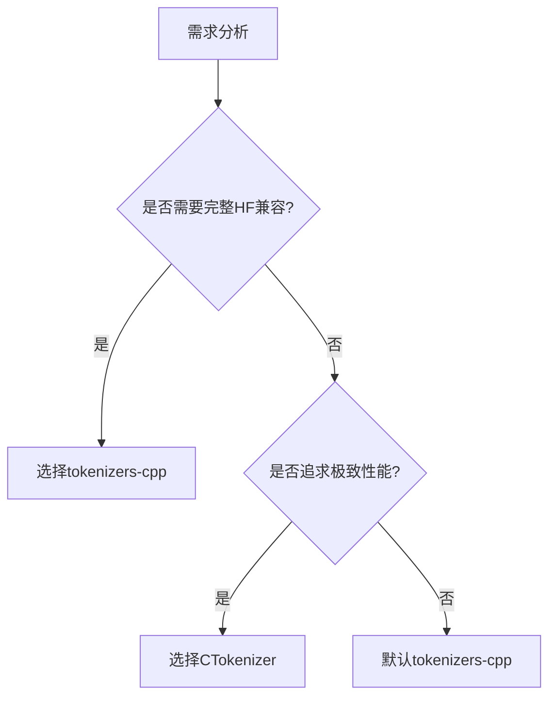

# Tokenizer模块详细设计

## 编程规范

本模块的编码实现遵循以下规范和约定：
- [C++编程规范.md](../C++编程规范.md)：定义编码风格、命名规范等
- [生成代码规范.md](../生成代码规范.md)：定义代码生成流程、设计文档一致性要求、优化同步机制等

## 0. 要生成的文件

### 0.1 头文件（include/cllm/tokenizer/）


| 文件名 | 对应类/结构体 | 说明 |
|--------|--------------|------|
| `tokenizer.h` | `Tokenizer` | 分词器主类，负责文本编解码 |
| `token.h` | `Token` | Token结构体 |
| `config.h` | `TokenizerConfig` | 分词器配置结构体 |
| `request.h` | `GenerationRequest` | 文本生成请求结构体 |
| `response.h` | `GenerationResponse` | 文本生成响应结构体 |
| `manager.h` | `TokenizerManager` | 分词器管理器 |
| `generator.h` | `TokenGenerator` | Token生成器 |
| `stats.h` | `TokenizerStats` | 分词器统计信息结构体 |

### 0.2 源文件（src/tokenizer/）

| 文件名 | 对应头文件 | 说明 |
|--------|-----------|------|
| `tokenizer.cpp` | `tokenizer.h` | Tokenizer类的实现 |
| `token.cpp` | `token.h` | Token类的实现 |
| `config.cpp` | `config.h` | TokenizerConfig类的实现 |
| `request.cpp` | `request.h` | GenerationRequest类的实现 |
| `response.cpp` | `response.h` | GenerationResponse类的实现 |
| `manager.cpp` | `manager.h` | TokenizerManager类的实现 |
| `generator.cpp` | `generator.h` | TokenGenerator类的实现 |
| `stats.cpp` | `stats.h` | TokenizerStats类的实现 |

### 0.3 测试文件（tests/）

| 文件名 | 测试目标 | 说明 |
|--------|---------|------|
| `test_tokenizer.cpp` | Tokenizer, TokenizerManager, TokenGenerator | 分词器模块的单元测试 |

### 0.4 文件命名规范说明

- **头文件名**：使用小写字母+下划线，与类名对应（大驼峰转小写下划线）
- **源文件名**：与对应头文件名保持一致
- **目录结构**：头文件位于 `include/cllm/tokenizer/`，源文件位于 `src/tokenizer/`

## 1. 模块概述

### 1.1 模块职责
Tokenizer模块负责文本的编码和解码，管理分词器，协调模型推理，支持流式和非流式文本生成。

### 1.2 核心功能
- 文本编码：将文本转换为token IDs
- 文本解码：将token IDs转换为文本
- 流式生成：逐token生成并返回文本
- 非流式生成：一次性生成完整文本
- Stop tokens处理：识别停止条件
- 采样参数控制：温度、top-p等参数管理
- 与模型执行器集成：调用模型进行推理
- KV缓存管理：利用缓存优化推理性能

### 1.3 设计原则
- 简单性：避免复杂的C++语法，使用RAII包装器
- 高性能：高效的编码和解码算法
- 可扩展性：支持多种分词器
- 可维护性：清晰的代码结构和命名规范
- 兼容性：与HuggingFace tokenizer兼容

### 1.4 技术选型（双方案可选）

#### 分词器方案
1. **tokenizers-cpp（推荐）**
   - 来源：HuggingFace官方C++实现
   - 优点：
     - 完整支持HuggingFace生态
     - 内置多种分词算法（BPE/WordPiece/Unigram）
     - 活跃的社区维护
   - 缺点：
     - 依赖Rust工具链
     - 二进制体积较大

2. **自研CTokenizer** 
   - 设计文档：参见[CTokenizer模块设计.md]
   - 优点：
     - 轻量级无依赖
     - 深度优化性能
     - 完全自主可控
   - 缺点：
     - 需要实现兼容层
     - 新模型支持需手动适配

#### 选择策略：


#### 基础组件
- JSON处理：nlohmann/json
- 字符串处理：标准C++字符串库 + SIMD优化
- 线程池：自定义ThreadPool模块
- 内存分配：mimalloc高性能分配器

## 2. 类设计

### 2.1 Token类

```cpp
class Token {
public:
    Token();
    Token(int id, const std::string& text, float score = 1.0f);
    
    int getId() const;
    std::string getText() const;
    float getScore() const;
    
    void setId(int id);
    void setText(const std::string& text);
    void setScore(float score);
    
private:
    int id_;
    std::string text_;
    float score_;
};
```

### 2.2 Tokenizer类

```cpp
class Tokenizer {
public:
    explicit Tokenizer(const std::string& modelPath);
    ~Tokenizer();
    
    std::vector<int> encode(const std::string& text, bool addSpecialTokens = false);
    std::string decode(const std::vector<int>& tokenIds, bool skipSpecialTokens = true);
    
    int getVocabSize() const;
    std::string getTokenText(int tokenId) const;
    bool isSpecialToken(int tokenId) const;
    
    void setPadToken(int tokenId);
    void setEosToken(int tokenId);
    void setBosToken(int tokenId);
    
    int getPadToken() const;
    int getEosToken() const;
    int getBosToken() const;
    
    void loadModel(const std::string& modelPath);
    void unloadModel();
    
    bool isLoaded() const;
    
private:
    void* tokenizerHandle_;
    std::string modelPath_;
    
    int padTokenId_;
    int eosTokenId_;
    int bosTokenId_;
    
    bool loaded_;
};
```

### 2.3 TokenizerConfig类

```cpp
class TokenizerConfig {
public:
    TokenizerConfig();
    ~TokenizerConfig();
    
    void setMaxTokens(int maxTokens);
    void setTemperature(float temperature);
    void setTopP(float topP);
    void setTopK(int topK);
    void setStopTokens(const std::vector<int>& stopTokens);
    void setRepeatPenalty(float repeatPenalty);
    
    int getMaxTokens() const;
    float getTemperature() const;
    float getTopP() const;
    int getTopK() const;
    std::vector<int> getStopTokens() const;
    float getRepeatPenalty() const;
    
    void loadFromJson(const nlohmann::json& json);
    nlohmann::json toJson() const;
    
private:
    int maxTokens_;
    float temperature_;
    float topP_;
    int topK_;
    std::vector<int> stopTokens_;
    float repeatPenalty_;
};
```

### 2.4 GenerationRequest类

```cpp
class GenerationRequest {
public:
    GenerationRequest();
    ~GenerationRequest();
    
    void setRequestId(const std::string& requestId);
    void setPrompt(const std::string& prompt);
    void setConfig(const TokenizerConfig& config);
    void setStream(bool stream);
    
    std::string getRequestId() const;
    std::string getPrompt() const;
    TokenizerConfig getConfig() const;
    bool isStream() const;
    
    std::vector<int> getEncodedPrompt() const;
    void setEncodedPrompt(const std::vector<int>& encodedPrompt);
    
private:
    std::string requestId_;
    std::string prompt_;
    TokenizerConfig config_;
    bool stream_;
    std::vector<int> encodedPrompt_;
};
```

### 2.5 GenerationResponse类

```cpp
class GenerationResponse {
public:
    GenerationResponse();
    ~GenerationResponse();
    
    void setRequestId(const std::string& requestId);
    void setText(const std::string& text);
    void setTokens(const std::vector<int>& tokens);
    void setFinished(bool finished);
    void setError(const std::string& error);
    void setResponseTime(float responseTime);
    
    std::string getRequestId() const;
    std::string getText() const;
    std::vector<int> getTokens() const;
    bool isFinished() const;
    std::string getError() const;
    float getResponseTime() const;
    
    nlohmann::json toJson() const;
    
private:
    std::string requestId_;
    std::string text_;
    std::vector<int> tokens_;
    bool finished_;
    std::string error_;
    float responseTime_;
};
```

### 2.6 TokenizerManager类

```cpp
class TokenizerManager {
public:
    explicit TokenizerManager(
        const std::string& modelPath,
        ModelExecutor* modelExecutor = nullptr
    );
    ~TokenizerManager();
    
    std::vector<int> encode(const std::string& text);
    std::string decode(const std::vector<int>& tokenIds);
    
    std::string generate(
        const std::string& requestId,
        const std::string& prompt,
        int maxTokens = 100,
        float temperature = 0.7f,
        float topP = 0.9f
    );
    
    std::vector<GenerationResponse> generateStream(
        const std::string& requestId,
        const std::string& prompt,
        int maxTokens = 100,
        float temperature = 0.7f,
        float topP = 0.9f
    );
    
    void setModelExecutor(ModelExecutor* modelExecutor);
    void setKVCache(KVCache* kvCache);
    
    Tokenizer* getTokenizer() const;
    ModelExecutor* getModelExecutor() const;
    KVCache* getKVCache() const;
    
    TokenizerStats getStats() const;
    void resetStats();
    
private:
    std::vector<int> encodePrompt(const std::string& prompt);
    std::string decodeTokens(const std::vector<int>& tokens);
    
    bool isStopToken(int tokenId);
    void updateStats(const std::string& requestId, int tokenCount, float time);
    
    Tokenizer* tokenizer_;
    ModelExecutor* modelExecutor_;
    KVCache* kvCache_;
    
    std::vector<int> stopTokens_;
    
    TokenizerStats stats_;
    mutable std::mutex statsMutex_;
};
```

### 2.7 StreamGenerator类

```cpp
class StreamGenerator {
public:
    explicit StreamGenerator(
        const std::string& requestId,
        const std::vector<int>& inputIds,
        int maxTokens,
        float temperature,
        ModelExecutor* modelExecutor,
        Tokenizer* tokenizer
    );
    ~StreamGenerator();
    
    bool hasNext();
    GenerationResponse next();
    
    bool isFinished() const;
    int getGeneratedTokenCount() const;
    
private:
    void generateNextToken();
    std::string extractNewText();
    
    std::string requestId_;
    std::vector<int> inputIds_;
    std::vector<int> generatedTokens_;
    std::string previousText_;
    
    int maxTokens_;
    float temperature_;
    
    ModelExecutor* modelExecutor_;
    Tokenizer* tokenizer_;
    
    bool finished_;
    int currentTokenIndex_;
};
```

### 2.8 TokenizerStats类

```cpp
class TokenizerStats {
public:
    TokenizerStats();
    ~TokenizerStats();
    
    void incrementEncodeCount();
    void incrementDecodeCount();
    void incrementGenerateCount();
    void incrementStreamGenerateCount();
    
    void addEncodeTime(float time);
    void addDecodeTime(float time);
    void addGenerateTime(float time);
    void addStreamGenerateTime(float time);
    
    void addGeneratedTokens(int count);
    
    long long getEncodeCount() const;
    long long getDecodeCount() const;
    long long getGenerateCount() const;
    long long getStreamGenerateCount() const;
    
    float getAverageEncodeTime() const;
    float getAverageDecodeTime() const;
    float getAverageGenerateTime() const;
    float getAverageStreamGenerateTime() const;
    
    long long getTotalGeneratedTokens() const;
    float getAverageTokensPerSecond() const;
    
    void reset();
    
    nlohmann::json toJson() const;
    
private:
    long long encodeCount_;
    long long decodeCount_;
    long long generateCount_;
    long long streamGenerateCount_;
    
    float totalEncodeTime_;
    float totalDecodeTime_;
    float totalGenerateTime_;
    float totalStreamGenerateTime_;
    
    long long totalGeneratedTokens_;
};
```

## 3. 接口设计

### 3.1 Tokenizer接口

```cpp
class ITokenizer {
public:
    virtual ~ITokenizer() {}
    
    virtual std::vector<int> encode(const std::string& text, bool addSpecialTokens = false) = 0;
    virtual std::string decode(const std::vector<int>& tokenIds, bool skipSpecialTokens = true) = 0;
    
    virtual int getVocabSize() const = 0;
    virtual std::string getTokenText(int tokenId) const = 0;
    
    virtual void loadModel(const std::string& modelPath) = 0;
    virtual void unloadModel() = 0;
    
    virtual bool isLoaded() const = 0;
};
```

### 3.2 TokenizerManager接口

```cpp
class ITokenizerManager {
public:
    virtual ~ITokenizerManager() {}
    
    virtual std::vector<int> encode(const std::string& text) = 0;
    virtual std::string decode(const std::vector<int>& tokenIds) = 0;
    
    virtual std::string generate(
        const std::string& requestId,
        const std::string& prompt,
        int maxTokens = 100,
        float temperature = 0.7f,
        float topP = 0.9f
    ) = 0;
    
    virtual std::vector<GenerationResponse> generateStream(
        const std::string& requestId,
        const std::string& prompt,
        int maxTokens = 100,
        float temperature = 0.7f,
        float topP = 0.9f
    ) = 0;
    
    virtual TokenizerStats getStats() const = 0;
    virtual void resetStats() = 0;
};
```

### 3.3 StreamGenerator接口

```cpp
class IStreamGenerator {
public:
    virtual ~IStreamGenerator() {}
    
    virtual bool hasNext() = 0;
    virtual GenerationResponse next() = 0;
    
    virtual bool isFinished() const = 0;
    virtual int getGeneratedTokenCount() const = 0;
};
```

## 4. 算法设计

### 4.1 文本编码算法

```
算法：encode
输入：text (字符串), addSpecialTokens (布尔值)
输出：token IDs列表

1. 初始化token IDs列表
2. 如果addSpecialTokens为true，添加BOS token
3. 将文本按词分割
4. 对每个词：
   a. 在词汇表中查找token ID
   b. 如果找到，添加到列表
   c. 如果未找到，使用子词分割算法
5. 如果addSpecialTokens为true，添加EOS token
6. 返回token IDs列表
```

### 4.2 文本解码算法

```
算法：decode
输入：tokenIds (整数列表), skipSpecialTokens (布尔值)
输出：解码后的文本

1. 初始化文本字符串
2. 遍历token IDs：
   a. 如果skipSpecialTokens为true且是特殊token，跳过
   b. 获取token对应的文本
   c. 拼接到结果文本
3. 处理特殊字符和空格
4. 返回解码后的文本
```

### 4.3 流式生成算法

```
算法：generateStream
输入：requestId, prompt, maxTokens, temperature, topP
输出：GenerationResponse列表

1. 编码prompt为token IDs
2. 初始化StreamGenerator对象
3. 创建响应列表
4. 循环直到生成完成：
   a. 生成下一个token
   b. 检查是否是停止token
   c. 解码新生成的文本
   d. 创建GenerationResponse对象
   e. 添加到响应列表
   f. 检查是否达到maxTokens
5. 返回响应列表
```

### 4.4 非流式生成算法

```
算法：generate
输入：requestId, prompt, maxTokens, temperature, topP
输出：生成的文本

1. 编码prompt为token IDs
2. 调用模型执行器进行推理
3. 获取生成的token IDs
4. 解码生成的token IDs为文本
5. 从完整文本中提取新生成的部分
6. 返回新生成的文本
```

### 4.5 增量文本提取算法

```
算法：extractNewText
输入：allText (完整文本), previousText (之前的文本)
输出：newText (新增文本)

1. 标准化文本（NFC normalization）
2. 查找新文本的起始位置
3. 提取从起始位置到结尾的文本
4. 返回新增文本
```

### 4.6 Stop Token检测算法

```
算法：isStopToken
输入：tokenId (整数)
输出：是否是停止token

1. 检查token ID是否在stopTokens列表中
2. 检查token ID是否是EOS token
3. 返回检测结果
```

## 5. 并发设计

### 5.1 并发模型
Tokenizer模块采用线程安全的并发模型：
- 每个生成请求独立处理
- 使用线程池执行模型推理
- 使用互斥锁保护统计数据
- 使用原子操作统计请求计数

### 5.2 线程模型
```
主线程
  ├── 编码线程（处理文本编码）
  ├── 解码线程（处理文本解码）
  └── 生成线程（使用线程池）
       ├── Worker 1
       ├── Worker 2
       ├── Worker 3
       └── Worker N
```

### 5.3 锁策略
- **TokenizerStats**：使用std::mutex保护统计数据的读写
- **Tokenizer**：无锁，只读数据结构
- **StreamGenerator**：无锁，每个生成器独立状态

### 5.4 并发安全
- 每个生成请求独立处理，不共享状态
- 使用RAII包装器管理资源生命周期
- 使用线程安全的日志记录器
- 使用原子操作统计请求计数

### 5.5 性能优化
- 使用线程池并行处理多个生成请求
- 使用缓存存储编码结果
- 使用内存池管理Token对象
- 使用零拷贝技术减少数据复制

## 6. 内存管理

### 6.1 内存分配策略
- 使用mimalloc作为全局内存分配器
- 使用RAII包装器管理Tokenizer和StreamGenerator对象
- 使用对象池管理频繁创建销毁的Token对象

### 6.2 RAII包装器
```cpp
class TokenizerWrapper {
public:
    explicit TokenizerWrapper(Tokenizer* tokenizer);
    ~TokenizerWrapper();
    
    Tokenizer* get() const;
    Tokenizer* release();
    
private:
    Tokenizer* tokenizer_;
};

class StreamGeneratorWrapper {
public:
    explicit StreamGeneratorWrapper(StreamGenerator* generator);
    ~StreamGeneratorWrapper();
    
    StreamGenerator* get() const;
    StreamGenerator* release();
    
private:
    StreamGenerator* generator_;
};
```

### 6.3 内存优化
- 使用字符串视图（string_view）避免字符串拷贝
- 使用移动语义减少对象拷贝
- 预分配token ID列表减少动态分配
- 使用内存池管理Token对象

### 6.4 内存监控
- 记录编码和解码的内存使用
- 统计内存分配和释放次数
- 监控内存泄漏
- 设置内存使用上限

## 7. 错误处理

### 7.1 错误类型
```cpp
enum TokenizerError {
    TOKENIZER_OK = 0,
    TOKENIZER_NOT_LOADED = 1,
    TOKENIZER_ENCODE_FAILED = 2,
    TOKENIZER_DECODE_FAILED = 3,
    TOKENIZER_GENERATE_FAILED = 4,
    TOKENIZER_INVALID_INPUT = 5,
    TOKENIZER_MODEL_ERROR = 6
};

class TokenizerException {
public:
    TokenizerException(int code, const std::string& message);
    
    int getCode() const;
    std::string getMessage() const;
    
private:
    int code_;
    std::string message_;
};
```

### 7.2 错误处理策略
- 分词器未加载：返回TOKENIZER_NOT_LOADED错误
- 编码失败：返回TOKENIZER_ENCODE_FAILED错误
- 解码失败：返回TOKENIZER_DECODE_FAILED错误
- 生成失败：返回TOKENIZER_GENERATE_FAILED错误
- 无效输入：返回TOKENIZER_INVALID_INPUT错误
- 所有错误都记录到日志

### 7.3 错误响应格式
```json
{
  "error": {
    "code": 4,
    "message": "Generation failed: model error"
  }
}
```

### 7.4 异常传播
- 使用try-catch捕获异常
- 将异常转换为TokenizerException
- 记录异常堆栈到日志
- 不泄露敏感信息

## 8. 性能优化

### 8.1 编码优化
- 使用高效的字符串分割算法
- 使用哈希表加速token查找
- 使用缓存存储常用词汇的编码结果
- 使用SIMD指令加速字符串处理

### 8.2 解码优化
- 使用预分配的字符串缓冲区
- 使用批量解码减少函数调用开销
- 使用缓存存储常用token的文本
- 使用零拷贝技术减少数据复制

### 8.3 生成优化
- 使用线程池并行处理多个生成请求
- 使用KV缓存减少重复计算
- 使用批处理提高吞吐量
- 使用异步I/O减少等待时间

### 8.4 内存优化
- 使用mimalloc提高内存分配性能
- 使用对象池减少内存分配开销
- 使用内存对齐提高访问速度
- 使用压缩存储减少内存占用

### 8.5 性能监控
- 记录编码和解码时间
- 统计生成吞吐量
- 监控内存使用情况
- 记录错误率

## 9. 测试设计

### 9.1 单元测试
- 测试Tokenizer的编码功能
- 测试Tokenizer的解码功能
- 测试TokenizerConfig的参数设置
- 测试GenerationRequest的参数解析
- 测试GenerationResponse的JSON序列化

### 9.2 集成测试
- 测试TokenizerManager的编码功能
- 测试TokenizerManager的解码功能
- 测试TokenizerManager的生成功能
- 测试TokenizerManager的流式生成功能
- 测试Stop Token的处理

### 9.3 性能测试
- 测试编码速度
- 测试解码速度
- 测试生成速度
- 测试流式生成的延迟
- 测试并发生成性能

### 9.4 压力测试
- 测试最大并发生成请求数
- 测试最大生成速率
- 测试内存泄漏
- 测试资源耗尽情况
- 测试恢复能力

### 9.5 测试用例示例

#### 9.5.1 编码测试
```cpp
TEST(TokenizerTest, EncodeText) {
    Tokenizer tokenizer("model_path");
    
    std::vector<int> tokens = tokenizer.encode("Hello, world!");
    
    EXPECT_FALSE(tokens.empty());
    EXPECT_GT(tokens.size(), 0);
}
```

#### 9.5.2 解码测试
```cpp
TEST(TokenizerTest, DecodeTokens) {
    Tokenizer tokenizer("model_path");
    
    std::vector<int> tokens = tokenizer.encode("Hello, world!");
    std::string text = tokenizer.decode(tokens);
    
    EXPECT_EQ(text, "Hello, world!");
}
```

#### 9.5.3 生成测试
```cpp
TEST(TokenizerManagerTest, GenerateText) {
    ModelExecutor* executor = createModelExecutor("model_path");
    TokenizerManager manager("model_path", executor);
    
    std::string result = manager.generate(
        "req_1",
        "Hello",
        10,
        0.7f,
        0.9f
    );
    
    EXPECT_FALSE(result.empty());
    EXPECT_GT(result.length(), 0);
}
```

#### 9.5.4 流式生成测试
```cpp
TEST(TokenizerManagerTest, GenerateStream) {
    ModelExecutor* executor = createModelExecutor("model_path");
    TokenizerManager manager("model_path", executor);
    
    std::vector<GenerationResponse> responses = manager.generateStream(
        "req_1",
        "Hello",
        10,
        0.7f,
        0.9f
    );
    
    EXPECT_FALSE(responses.empty());
    EXPECT_TRUE(responses.back().isFinished());
}
```

## 10. 部署和配置

### 10.1 配置参数
```cpp
struct TokenizerConfig {
    std::string modelPath;
    int maxTokens;
    float temperature;
    float topP;
    int topK;
    std::vector<int> stopTokens;
    float repeatPenalty;
    bool enableCache;
    int cacheSize;
};
```

### 10.2 环境变量
- `TOKENIZER_MODEL_PATH`: 分词器模型路径
- `TOKENIZER_MAX_TOKENS`: 最大生成token数
- `TOKENIZER_TEMPERATURE`: 默认温度参数
- `TOKENIZER_TOP_P`: 默认top-p参数
- `TOKENIZER_TOP_K`: 默认top-k参数
- `TOKENIZER_ENABLE_CACHE`: 是否启用缓存
- `TOKENIZER_CACHE_SIZE`: 缓存大小

### 10.3 启动流程
1. 读取配置文件和环境变量
2. 初始化Tokenizer对象
3. 加载分词器模型
4. 初始化TokenizerManager对象
5. 设置ModelExecutor和KVCache
6. 等待生成请求
7. 处理生成请求
8. 清理资源

## 11. 日志和监控

### 11.1 日志记录
- 记录每个编码请求的基本信息
- 记录每个解码请求的基本信息
- 记录每个生成请求的基本信息
- 记录生成处理时间
- 记录错误和异常
- 记录性能指标

### 11.2 监控指标
- 编码请求数
- 解码请求数
- 生成请求数
- 流式生成请求数
- 平均编码时间
- 平均解码时间
- 平均生成时间
- 平均流式生成时间
- 总生成token数
- 平均每秒生成token数

### 11.3 健康检查
- 检查分词器是否加载
- 检查模型执行器是否可用
- 检查KV缓存是否可用
- 检查内存使用情况
- 提供健康检查接口

## 12. 安全考虑

### 12.1 输入验证
- 验证输入文本的长度
- 验证生成参数的范围
- 防止缓冲区溢出
- 防止整数溢出

### 12.2 资源限制
- 限制最大生成token数
- 限制最大并发请求数
- 限制内存使用量
- 限制生成时间

### 12.3 数据保护
- 敏感数据脱敏
- 安全存储模型文件
- 定期更新依赖库
- 使用安全的随机数生成器

## 13. 总结

Tokenizer模块是cLLM系统的核心组件之一，负责文本的编码和解码，以及文本生成的协调工作。本设计文档详细描述了模块的类设计、接口设计、算法设计、并发设计、内存管理、错误处理、性能优化和测试设计等方面。

模块采用线程安全的并发模型，使用tokenizers-cpp作为分词器库，mimalloc作为内存分配器，RAII包装器管理资源生命周期。模块提供了编码、解码、流式生成和非流式生成等功能，支持多种采样参数，具有良好的性能和可扩展性。

模块遵循C++编程规范，使用简单的C++语法，避免复杂的模板和智能指针，确保代码的可读性和可维护性。
