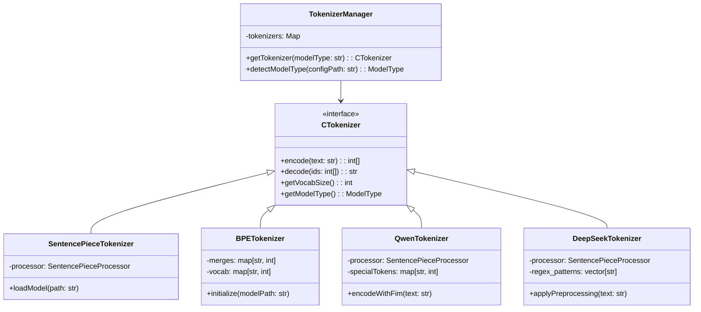

# cLLM CTokenizer模块设计（通用版）

## 编程规范

本模块的编码实现遵循以下规范和约定：
- [C++编程规范.md](../C++编程规范.md)：定义编码风格、命名规范等
- [生成代码规范.md](../生成代码规范.md)：定义代码生成流程、设计文档一致性要求、优化同步机制等


## 1. 设计目标

### 1.1 核心功能
- 文本 ↔ Token ID 双向转换
- 支持主流模型格式（HuggingFace/SentencePiece/Qwen/DeepSeek/Llama等）
- 特殊 Token 处理（BOS/EOS/PAD/FIM等）
- 流式处理支持
- 高性能分词算法

### 1.2 性能指标
- 编码速度 ≥ 50MB/s
- 内存占用 ≤ 50MB
- 加载时间 ≤ 100ms
- 支持多种预处理器（DeepSeek、Qwen等特定预处理）

### 1.3 兼容性目标
- 支持Qwen系列模型（Qwen、Qwen2等）
- 支持DeepSeek系列模型（DeepSeek-LLM、DeepSeek-Coder、DeepSeek3等）
- 支持Llama系列模型
- 向后兼容现有SentencePiece模型

## 2. 架构设计

### 2.1 模块组成
```
┌─────────────────────────────────────┐
│            TokenizerManager         │
│  ┌────────────────────────────────┐ │
│  │         CTokenizer             │ │
│  │  ┌─────────────────────────┐   │ │
│  │  │   SentencePieceEngine   │   │ │
│  │  └─────────────────────────┘   │ │
│  │  ┌─────────────────────────┐   │ │
│  │  │    BPEEngine            │   │ │
│  │  └─────────────────────────┘   │ │
│  │  ┌─────────────────────────┐   │ │
│  │  │     JsonTokenizer       │   │ │
│  │  └─────────────────────────┘   │ │
│  └────────────────────────────────┘ │
│                                     │
│  ┌────────────────────────────────┐ │
│  │        ModelDetector           │ │
│  │  Detect model type (Qwen,     │ │
│  │  DeepSeek, Llama, etc.)      │ │
│  └────────────────────────────────┘ │
└─────────────────────────────────────┘
```

### 2.2 类关系图


## 3. 详细设计

### 3.1 接口定义

```cpp
enum class ModelType {
    AUTO,           // 自动检测
    QWEN,           // Qwen系列模型
    QWEN2,          // Qwen2系列模型
    DEEPSEEK_LLM,   // DeepSeek LLM模型
    DEEPSEEK_CODER, // DeepSeek Coder模型
    DEEPSEEK3_LLM,  // DeepSeek3 LLM模型
    LLAMA,          // Llama系列模型
    BERT,           // BERT系列模型
    GPT2,           // GPT2系列模型
    SPM,            // SentencePiece模型
    BPE,            // BPE模型
    WPM             // WordPiece模型
};

class CTokenizer {
public:
    virtual ~CTokenizer() = default;
    
    // 核心功能
    virtual std::vector<int> encode(
        const std::string& text, 
        bool addSpecialTokens = true
    ) = 0;
    
    virtual std::string decode(
        const std::vector<int>& ids,
        bool skipSpecialTokens = true
    ) = 0;
    
    // 词汇表操作
    virtual int getVocabSize() const = 0;
    virtual std::string idToToken(int id) const = 0;
    virtual int tokenToId(const std::string& token) const = 0;
    
    // 特殊Token
    virtual int getBosId() const = 0;
    virtual int getEosId() const = 0;
    virtual int getPadId() const = 0;
    virtual int getUnkId() const = 0;
    
    // 模型类型
    virtual ModelType getModelType() const = 0;
    
    // 加载模型
    virtual bool load(const std::string& modelPath) = 0;
};
```

### 3.2 通用分词器实现

#### 3.2.1 SentencePieceTokenizer 实现

```cpp
class SentencePieceTokenizer : public CTokenizer {
private:
    std::unique_ptr<sentencepiece::SentencePieceProcessor> processor_;
    ModelType modelType_;
    std::unordered_map<std::string, int> specialTokens_;
    std::unordered_map<int, std::string> idToTokenMap_;
    
    // 特殊token ID
    int bosId_{-1};
    int eosId_{-1};
    int padId_{-1};
    int unkId_{-1};
    
public:
    explicit SentencePieceTokenizer(ModelType modelType);
    ~SentencePieceTokenizer() override;
    
    bool load(const std::string& modelPath) override;
    std::vector<int> encode(const std::string& text, bool addSpecialTokens = true) override;
    std::string decode(const std::vector<int>& ids, bool skipSpecialTokens = true) override;
    
    int getVocabSize() const override;
    std::string idToToken(int id) const override;
    int tokenToId(const std::string& token) const override;
    
    int getBosId() const override { return bosId_; }
    int getEosId() const override { return eosId_; }
    int getPadId() const override { return padId_; }
    int getUnkId() const override { return unkId_; }
    
    ModelType getModelType() const override { return modelType_; }
    
private:
    void loadModelConfig(const std::string& configPath);
    void loadSpecialTokens(const std::string& configPath);
    void initializeRegexPatterns();
};
```

#### 3.2.2 DeepSeek 分词器实现

```cpp
class DeepSeekTokenizer : public SentencePieceTokenizer {
public:
    explicit DeepSeekTokenizer(ModelType modelType) : SentencePieceTokenizer(modelType) {}
    
    std::vector<int> encode(const std::string& text, bool addSpecialTokens = true) override {
        // 应用DeepSeek特定的预处理
        std::string processedText = applyDeepSeekPreprocessing(text);
        return SentencePieceTokenizer::encode(processedText, addSpecialTokens);
    }
    
private:
    std::string applyDeepSeekPreprocessing(const std::string& text) {
        // DeepSeek特定的预处理逻辑
        // 根据模型类型应用不同的正则表达式
        switch(getModelType()) {
            case ModelType::DEEPSEEK_LLM:
                return applyDeepSeekLLMPreprocessing(text);
            case ModelType::DEEPSEEK_CODER:
                return applyDeepSeekCoderPreprocessing(text);
            case ModelType::DEEPSEEK3_LLM:
                return applyDeepSeek3Preprocessing(text);
            default:
                return text;
        }
    }
    
    std::string applyDeepSeekLLMPreprocessing(const std::string& text) {
        // DeepSeek LLM使用的正则表达式模式：
        // - "[\r\n]": 匹配换行符
        // - "\\s?[A-Za-z...]": 匹配字母字符
        // - "\\s?[!-/:-~...]": 匹配标点符号
        // - "[一-龥...]": 匹配中文字符
        // - "\\p{N}+": 匹配数字
        return text; // 实际实现将在cpp文件中
    }
    
    std::string applyDeepSeekCoderPreprocessing(const std::string& text) {
        // DeepSeek Coder使用的正则表达式模式：
        // - "[\r\n]": 匹配换行符
        // - "\\s?\\p{L}+": 匹配字母
        // - "\\s?\\p{P}+": 匹配标点
        // - "[一-龥...]": 匹配中文字符
        // - "\\p{N}": 匹配数字
        return text; // 实际实现将在cpp文件中
    }
    
    std::string applyDeepSeek3Preprocessing(const std::string& text) {
        // DeepSeek3使用的正则表达式模式：
        // - "\\p{N}{1,3}": 匹配1-3位数字
        // - "[一-龥...]": 匹配中文字符
        // - 复杂的混合模式用于匹配各种字符组合
        return text; // 实际实现将在cpp文件中
    }
};
```

#### 3.2.3 Qwen 分词器实现

```cpp
class QwenTokenizer : public SentencePieceTokenizer {
public:
    explicit QwenTokenizer() : SentencePieceTokenizer(ModelType::QWEN) {}
    
    std::vector<int> encode(const std::string& text, bool addSpecialTokens = true) override {
        // Qwen特定的FIM（Fill-in-the-Middle）处理
        if (needsFimProcessing(text)) {
            return encodeWithFim(text, addSpecialTokens);
        }
        return SentencePieceTokenizer::encode(text, addSpecialTokens);
    }
    
private:
    bool needsFimProcessing(const std::string& text) {
        // 检查是否需要FIM处理
        // Qwen模型特有的FIM tokens: <｜fim_begin｜>, <｜fim_end｜>, <｜fim_pad｜>, <｜fim_suf｜>, <｜fim_pre｜>
        return text.find("<｜fim_begin｜>") != std::string::npos || 
               text.find("<｜fim_end｜>") != std::string::npos;
    }
    
    std::vector<int> encodeWithFim(const std::string& text, bool addSpecialTokens) {
        // Qwen的FIM处理逻辑
        // 这里实现Qwen特有的FIM（Fill-in-the-Middle）分词逻辑
        std::vector<int> result;
        
        // 实际的FIM处理将在cpp文件中实现
        return SentencePieceTokenizer::encode(text, addSpecialTokens);
    }
    
    std::string applyQwenPreprocessing(const std::string& text) {
        // Qwen2使用的预处理逻辑
        // 正则表达式模式：
        // - "(?:'[sS]|'[tT]|'[rR][eE]|'[vV][eE]|'[mM]|'[lL][lL]|'[dD])": 匹配英语缩写
        // - "[^\\r\\n\\p{L}\\p{N}]?\\p{L}+": 匹配字母序列
        // - "\\p{N}": 匹配数字
        // - 复杂的空白和标点处理模式
        return text; // 实际实现将通过预处理器处理
    }
};
```

### 3.3 性能优化

#### 3.3.1 内存缓存设计

```cpp
class TokenCache {
private:
    std::unordered_map<std::string, std::vector<int>> encodeCache_;
    std::unordered_map<std::vector<int>, std::string, VectorHash> decodeCache_;
    mutable std::shared_mutex mutex_;
    size_t maxSize_;
    
public:
    TokenCache(size_t maxSize = 10000) : maxSize_(maxSize) {}
    
    void putEncode(const std::string& text, const std::vector<int>& tokens) {
        std::unique_lock lock(mutex_);
        if (encodeCache_.size() >= maxSize_) {
            encodeCache_.erase(encodeCache_.begin()); // 简单的LRU策略
        }
        encodeCache_[text] = tokens;
    }
    
    std::optional<std::vector<int>> getEncode(const std::string& text) const {
        std::shared_lock lock(mutex_);
        auto it = encodeCache_.find(text);
        return it != encodeCache_.end() ? std::make_optional(it->second) : std::nullopt;
    }
    
    void putDecode(const std::vector<int>& tokens, const std::string& text) {
        std::unique_lock lock(mutex_);
        if (decodeCache_.size() >= maxSize_) {
            decodeCache_.erase(decodeCache_.begin()); // 简单的LRU策略
        }
        decodeCache_[tokens] = text;
    }
    
    std::optional<std::string> getDecode(const std::vector<int>& tokens) const {
        std::shared_lock lock(mutex_);
        auto it = decodeCache_.find(tokens);
        return it != decodeCache_.end() ? std::make_optional(it->second) : std::nullopt;
    }
};
```

#### 3.3.2 批处理接口

```cpp
class BatchTokenizer {
public:
    struct BatchResult {
        std::vector<std::vector<int>> tokenized;
        std::vector<bool> success;
        std::vector<std::string> errors;
    };
    
    static BatchResult batchEncode(
        CTokenizer* tokenizer,
        const std::vector<std::string>& texts,
        bool addSpecialTokens = true,
        int maxParallel = 4
    );
    
    static std::vector<std::string> batchDecode(
        CTokenizer* tokenizer,
        const std::vector<std::vector<int>>& tokenLists,
        bool skipSpecialTokens = true,
        int maxParallel = 4
    );
};
```

## 4. 模型兼容性

### 4.1 支持格式
| 格式类型 | 文件示例 | 加载方式 | 适用模型 |
|---------|---------|---------|----------|
| SentencePiece | model.spm | 直接加载 | Llama、早期模型 |
| HuggingFace | tokenizer.json | 解析配置 | 大多数现代模型 |
| BPE | vocab.json + merges.txt | 解析词汇表和合并规则 | GPT系列模型 |
| TikToken | qwen.tiktoken | 自定义解析 | Qwen系列 |

### 4.2 自动检测机制

```cpp
class ModelDetector {
public:
    static ModelType detectModelType(const std::string& configPath) {
        try {
            auto config = readJson(configPath);
            
            // 检查tokenizer_class字段
            if (config.contains("tokenizer_class")) {
                std::string tokenizerClass = config["tokenizer_class"].get<std::string>();
                
                if (tokenizerClass.find("Qwen") != std::string::npos) {
                    return ModelType::QWEN;
                } else if (tokenizerClass.find("DeepSeek") != std::string::npos) {
                    if (tokenizerClass.find("DeepSeek3") != std::string::npos) {
                        return ModelType::DEEPSEEK3_LLM;
                    } else if (tokenizerClass.find("Coder") != std::string::npos) {
                        return ModelType::DEEPSEEK_CODER;
                    } else {
                        return ModelType::DEEPSEEK_LLM;
                    }
                } else if (tokenizerClass.find("Llama") != std::string::npos) {
                    return ModelType::LLAMA;
                } else if (tokenizerClass.find("Bert") != std::string::npos) {
                    return ModelType::BERT;
                } else if (tokenizerClass.find("GPT2") != std::string::npos) {
                    return ModelType::GPT2;
                }
            }
            
            // 检查chat_template字段
            if (config.contains("chat_template")) {
                std::string chatTemplate = config["chat_template"].get<std::string>();
                
                if (chatTemplate.find("qwen") != std::string::npos) {
                    return ModelType::QWEN;
                } else if (chatTemplate.find("deepseek") != std::string::npos) {
                    if (chatTemplate.find("deepseek3") != std::string::npos) {
                        return ModelType::DEEPSEEK3_LLM;
                    } else if (chatTemplate.find("coder") != std::string::npos) {
                        return ModelType::DEEPSEEK_CODER;
                    } else {
                        return ModelType::DEEPSEEK_LLM;
                    }
                }
            }
            
            // 检查model_type字段
            if (config.contains("model_type")) {
                std::string modelType = config["model_type"].get<std::string>();
                
                if (modelType.find("qwen") != std::string::npos) {
                    return ModelType::QWEN;
                } else if (modelType.find("deepseek") != std::string::npos) {
                    if (modelType.find("deepseek3") != std::string::npos) {
                        return ModelType::DEEPSEEK3_LLM;
                    } else if (modelType.find("coder") != std::string::npos) {
                        return ModelType::DEEPSEEK_CODER;
                    } else {
                        return ModelType::DEEPSEEK_LLM;
                    }
                }
            }
            
            // 检查特殊token名称模式
            if (config.contains("added_tokens_decoder")) {
                auto tokens = config["added_tokens_decoder"];
                for (auto& item : tokens.items()) {
                    if (item.value().contains("content")) {
                        std::string content = item.value()["content"];
                        if (content == "<｜fim_begin｜>" || content == "<｜fim_end｜>" || content == "<｜fim_pad｜>" || 
                            content == "<｜fim_suf｜>" || content == "<｜fim_pre｜>") {
                            return ModelType::QWEN;  // Qwen特有的FIM tokens
                        } else if (content.find("deepseek") != std::string::npos) {
                            return ModelType::DEEPSEEK_LLM;
                        }
                    }
                }
            }
            
            // 默认返回SPM
            return ModelType::SPM;
        } catch (const std::exception& e) {
            // 如果解析失败，返回默认类型
            return ModelType::SPM;
        }
    }
};
```

### 4.3 特殊Token处理

``cpp
// 从配置文件加载特殊Token
void loadSpecialTokens(CTokenizer* tokenizer, const std::string& configPath) {
    auto json = readJson(configPath);
    
    // 标准特殊Token
    if (json.contains("bos_token_id")) {
        // 设置BOS ID
    }
    if (json.contains("eos_token_id")) {
        // 设置EOS ID
    }
    if (json.contains("pad_token_id")) {
        // 设置PAD ID
    }
    if (json.contains("unk_token_id")) {
        // 设置UNK ID
    }
    
    // 模型特定的特殊Token
    if (json.contains("additional_special_tokens")) {
        // 处理额外的特殊Token
    }
}
```

## 5. 实现策略

### 5.1 通用分词器集成方案
- 使用SentencePiece作为基础分词引擎
- 封装不同模型的特殊处理逻辑
- 保持与现有API的兼容性
- 实现模型特定的预处理器支持

### 5.2 逐步迁移策略
1. **第一阶段**: 实现基础SentencePiece分词器封装
2. **第二阶段**: 添加DeepSeek和Qwen模型支持
3. **第三阶段**: 优化性能和内存使用
4. **第四阶段**: 集成到cLLM主流程

### 5.3 性能优化考虑
- 实现token缓存机制
- 优化字符串处理
- 使用高效的正则表达式引擎
- 预分配内存减少动态分配开销
- 并行批处理支持

## 6. 测试验证方案

### 6.1 单元测试

#### 6.1.1 基础功能测试
``cpp
TEST(SentencePieceTokenizerTest, QwenEncodeDecode) {
    SentencePieceTokenizer tokenizer(ModelType::QWEN);
    ASSERT_TRUE(tokenizer.load("test_models/qwen/tokenizer.json"));
    
    std::string text = "Hello, world!";
    auto ids = tokenizer.encode(text);
    ASSERT_FALSE(ids.empty());
    
    std::string decoded = tokenizer.decode(ids);
    EXPECT_EQ(decoded, text);
}

TEST(DeepSeekTokenizerTest, DeepSeekCoderPreprocessing) {
    DeepSeekTokenizer tokenizer(ModelType::DEEPSEEK_CODER);
    ASSERT_TRUE(tokenizer.load("test_models/deepseek-coder/config.json"));
    
    std::string text = "def hello_world():\n    print('Hello')";
    auto ids = tokenizer.encode(text);
    ASSERT_FALSE(ids.empty());
}

TEST(QwenTokenizerTest, FimProcessing) {
    QwenTokenizer tokenizer;
    ASSERT_TRUE(tokenizer.load("test_models/qwen/tokenizer.json"));
    
    // 测试FIM处理
    std::string text = "def hello_world() -> str:\n    return \"Hello World\"";
    auto ids = tokenizer.encode(text);
    ASSERT_FALSE(ids.empty());
    
    std::string decoded = tokenizer.decode(ids);
    EXPECT_EQ(decoded, text);
}
```

#### 6.1.2 模型兼容性测试
``cpp
TEST(ModelDetectorTest, AutoDetection) {
    // 测试模型自动检测功能
    ModelType type = ModelDetector::detectModelType("test_models/qwen/config.json");
    EXPECT_EQ(type, ModelType::QWEN);
    
    type = ModelDetector::detectModelType("test_models/deepseek-coder/config.json");
    EXPECT_EQ(type, ModelType::DEEPSEEK_CODER);
    
    type = ModelDetector::detectModelType("test_models/deepseek-llm/config.json");
    EXPECT_EQ(type, ModelType::DEEPSEEK_LLM);
}

TEST(TokenizerManagerTest, GetTokenizer) {
    TokenizerManager manager;
    
    auto qwenTokenizer = manager.getTokenizer("qwen");
    ASSERT_NE(qwenTokenizer, nullptr);
    EXPECT_EQ(qwenTokenizer->getModelType(), ModelType::QWEN);
    
    auto deepseekTokenizer = manager.getTokenizer("deepseek-coder");
    ASSERT_NE(deepseekTokenizer, nullptr);
    EXPECT_EQ(deepseekTokenizer->getModelType(), ModelType::DEEPSEEK_CODER);
}
```

#### 6.1.3 特殊Token处理测试
``cpp
TEST(CTokenizerTest, SpecialTokens) {
    CTokenizer tokenizer(ModelType::QWEN);
    ASSERT_TRUE(tokenizer.load("test_models/qwen/tokenizer.json"));
    
    // 测试特殊Token
    int bosId = tokenizer.getBosId();
    int eosId = tokenizer.getEosId();
    int padId = tokenizer.getPadId();
    
    EXPECT_GT(bosId, 0);
    EXPECT_GT(eosId, 0);
    EXPECT_GE(padId, 0); // padId可能为-1（未设置）
    
    // 测试带特殊Token的编码
    std::string text = "Hello";
    auto idsWithoutSpecial = tokenizer.encode(text, false);
    auto idsWithSpecial = tokenizer.encode(text, true);
    
    // 带特殊Token的序列应该更长
    EXPECT_GE(idsWithSpecial.size(), idsWithoutSpecial.size());
}

TEST(CTokenizerTest, VocabOperations) {
    CTokenizer tokenizer(ModelType::QWEN);
    ASSERT_TRUE(tokenizer.load("test_models/qwen/tokenizer.json"));
    
    // 测试词汇表操作
    int vocabSize = tokenizer.getVocabSize();
    EXPECT_GT(vocabSize, 0);
    
    // 测试ID到Token的转换
    std::string token = tokenizer.idToToken(100); // 假设ID 100存在
    EXPECT_FALSE(token.empty());
    
    // 测试Token到ID的转换
    int id = tokenizer.tokenToId(token);
    EXPECT_EQ(token, tokenizer.idToToken(id));
}
```

#### 6.1.4 边界条件测试
``cpp
TEST(CTokenizerTest, BoundaryConditions) {
    CTokenizer tokenizer(ModelType::QWEN);
    ASSERT_TRUE(tokenizer.load("test_models/qwen/tokenizer.json"));
    
    // 空字符串测试
    auto emptyIds = tokenizer.encode("");
    EXPECT_TRUE(emptyIds.empty() || emptyIds.size() == 2); // 可能包含BOS/EOS
    
    // 单字符测试
    auto singleCharIds = tokenizer.encode("A");
    EXPECT_FALSE(singleCharIds.empty());
    
    std::string singleDecoded = tokenizer.decode(singleCharIds);
    EXPECT_EQ(singleDecoded, "A");
    
    // 特殊字符测试
    std::string specialText = "Hello, 世界! 🌍";
    auto specialIds = tokenizer.encode(specialText);
    ASSERT_FALSE(specialIds.empty());
    
    std::string specialDecoded = tokenizer.decode(specialIds);
    EXPECT_EQ(specialDecoded, specialText);
}
```

### 6.2 集成测试

#### 6.2.1 端到端测试
``cpp
TEST(IntegrationTest, EndToEnd) {
    // 模拟完整的工作流
    TokenizerManager manager;
    auto tokenizer = manager.getTokenizer("qwen");
    ASSERT_NE(tokenizer, nullptr);
    
    std::string input = "This is a test sentence for end-to-end validation.";
    auto tokens = tokenizer->encode(input);
    ASSERT_FALSE(tokens.empty());
    
    std::string output = tokenizer->decode(tokens);
    EXPECT_EQ(input, output);
    
    // 验证词汇表大小的一致性
    int vocabSize = tokenizer->getVocabSize();
    EXPECT_GT(vocabSize, 1000); // 合理的词汇表大小
}

TEST(IntegrationTest, MultiModelSupport) {
    TokenizerManager manager;
    
    // 测试不同模型类型的分词器
    std::vector<std::string> modelTypes = {"qwen", "deepseek-llm", "deepseek-coder"};
    
    for (const auto& modelType : modelTypes) {
        auto tokenizer = manager.getTokenizer(modelType);
        ASSERT_NE(tokenizer, nullptr) << "Failed to get tokenizer for " << modelType;
        
        std::string testText = "Test text for " + modelType;
        auto tokens = tokenizer->encode(testText);
        ASSERT_FALSE(tokens.empty()) << "Encoding failed for " << modelType;
        
        std::string decoded = tokenizer->decode(tokens);
        EXPECT_EQ(decoded, testText) << "Decoding mismatch for " << modelType;
    }
}
```

#### 6.2.2 批处理测试
``cpp
TEST(BatchTokenizerTest, BatchEncodeDecode) {
    LlamaCppTokenizer tokenizer(ModelType::QWEN);
    ASSERT_TRUE(tokenizer.load("test_models/qwen/tokenizer.json"));
    
    std::vector<std::string> texts = {
        "Hello, world!",
        "This is a test sentence.",
        "Another test with numbers: 12345",
        "Mixed content: Hello 世界 🌍"
    };
    
    // 测试批量编码
    auto batchResult = BatchTokenizer::batchEncode(&tokenizer, texts, true, 4);
    ASSERT_EQ(batchResult.tokenized.size(), texts.size());
    
    // 验证每个文本都被成功编码
    for (size_t i = 0; i < batchResult.success.size(); ++i) {
        EXPECT_TRUE(batchResult.success[i]) << "Batch encoding failed for text " << i;
        EXPECT_FALSE(batchResult.tokenized[i].empty()) << "Empty result for text " << i;
    }
    
    // 测试批量解码
    std::vector<std::string> decoded = BatchTokenizer::batchDecode(
        &tokenizer, batchResult.tokenized, true, 4
    );
    
    ASSERT_EQ(decoded.size(), texts.size());
    for (size_t i = 0; i < texts.size(); ++i) {
        EXPECT_EQ(decoded[i], texts[i]) << "Batch decode mismatch for text " << i;
    }
}
```

### 6.3 性能测试

#### 6.3.1 基准测试
``cpp
TEST(PerformanceTest, EncodeSpeed) {
    CTokenizer tokenizer(ModelType::QWEN);
    ASSERT_TRUE(tokenizer.load("test_models/qwen/tokenizer.json"));
    
    std::string longText;
    for (int i = 0; i < 1000; ++i) {
        longText += "This is a test sentence for performance evaluation. ";
    }
    
    auto start = std::chrono::high_resolution_clock::now();
    auto tokens = tokenizer.encode(longText);
    auto end = std::chrono::high_resolution_clock::now();
    
    auto duration = std::chrono::duration_cast<std::chrono::milliseconds>(end - start);
    EXPECT_LT(duration.count(), 1000); // 应该在1秒内完成
    
    EXPECT_FALSE(tokens.empty());
    
    // 计算编码速度 (字符/秒)
    double speed = (double)longText.length() / (duration.count() / 1000.0);
    EXPECT_GT(speed, 50000); // 至少50KB/s
}

TEST(PerformanceTest, DecodeSpeed) {
    CTokenizer tokenizer(ModelType::QWEN);
    ASSERT_TRUE(tokenizer.load("test_models/qwen/tokenizer.json"));
    
    std::string text = "Performance test text. ";
    auto tokens = tokenizer.encode(text);
    
    // 重复多次以获得更好的测量结果
    std::vector<std::vector<int>> batchTokens;
    for (int i = 0; i < 1000; ++i) {
        batchTokens.push_back(tokens);
    }
    
    auto start = std::chrono::high_resolution_clock::now();
    std::vector<std::string> decoded = BatchTokenizer::batchDecode(
        &tokenizer, batchTokens, true, 4
    );
    auto end = std::chrono::high_resolution_clock::now();
    
    auto duration = std::chrono::duration_cast<std::chrono::milliseconds>(end - start);
    EXPECT_LT(duration.count(), 1000); // 应该在1秒内完成
    
    EXPECT_EQ(decoded.size(), batchTokens.size());
}

TEST(PerformanceTest, MemoryUsage) {
    CTokenizer tokenizer(ModelType::QWEN);
    ASSERT_TRUE(tokenizer.load("test_models/qwen/tokenizer.json"));
    
    // 检查初始内存使用
    size_t initialMemory = getCurrentMemoryUsage();
    
    // 执行多次编码/解码操作
    for (int i = 0; i < 10000; ++i) {
        std::string text = "Test " + std::to_string(i);
        auto tokens = tokenizer.encode(text);
        std::string decoded = tokenizer.decode(tokens);
    }
    
    size_t finalMemory = getCurrentMemoryUsage();
    
    // 内存增长不应超过阈值（例如10MB）
    EXPECT_LT(finalMemory - initialMemory, 10 * 1024 * 1024);
}
```

### 6.4 验证测试

#### 6.4.1 精度验证
``cpp
TEST(ValidationTest, CrossPlatformConsistency) {
    // 验证在不同平台上产生的结果一致性
    CTokenizer tokenizer(ModelType::QWEN);
    ASSERT_TRUE(tokenizer.load("test_models/qwen/tokenizer.json"));
    
    std::vector<std::string> testCases = {
        "Hello, world!",
        "测试中文分词",
        "Test with numbers: 123456789",
        "Mixed: Hello 世界 🌍 emoji",
        "Special chars: !@#$%^&*()",
        "Long text with multiple sentences. This is sentence two. And this is three."
    };
    
    for (const auto& testCase : testCases) {
        auto tokens = tokenizer.encode(testCase);
        std::string decoded = tokenizer.decode(tokens);
        
        EXPECT_EQ(testCase, decoded) << "Mismatch for test case: " << testCase;
        
        // 验证词汇表大小的一致性
        int vocabSize = tokenizer.getVocabSize();
        EXPECT_GT(vocabSize, 0);
    }
}

TEST(ValidationTest, ModelSpecificFeatures) {
    // 验证特定模型的特征
    {
        // Qwen模型特有功能测试
        QwenTokenizer qwenTokenizer;
        ASSERT_TRUE(qwenTokenizer.load("test_models/qwen/tokenizer.json"));
        
        // 测试Qwen特有的FIM处理
        std::string code = "def function():\n    pass";
        auto tokens = qwenTokenizer.encode(code);
        EXPECT_FALSE(tokens.empty());
        
        std::string decoded = qwenTokenizer.decode(tokens);
        EXPECT_EQ(decoded, code);
    }
    
    {
        // DeepSeek模型特有功能测试
        DeepSeekTokenizer deepseekTokenizer(ModelType::DEEPSEEK_CODER);
        ASSERT_TRUE(deepseekTokenizer.load("test_models/deepseek-coder/config.json"));
        
        // 测试DeepSeek特定的预处理
        std::string code = "class MyClass:\n    def method(self):\n        return True";
        auto tokens = deepseekTokenizer.encode(code);
        EXPECT_FALSE(tokens.empty());
        
        std::string decoded = deepseekTokenizer.decode(tokens);
        EXPECT_EQ(decoded, code);
    }
}
```

#### 6.4.2 回归测试
``cpp
TEST(RegressionTest, KnownIssues) {
    // 针对已知问题的回归测试
    CTokenizer tokenizer(ModelType::QWEN);
    ASSERT_TRUE(tokenizer.load("test_models/qwen/tokenizer.json"));
    
    // 测试可能导致问题的特定输入
    std::vector<std::string> problematicInputs = {
        "", // 空字符串
        " ", // 单空格
        "\n", // 単换行
        "\t", // 単制表符
        "\r\n", // Windows换行
        std::string(1000, 'A'), // 长重复字符串
        "A" + std::string(1000, 'B') + "C", // 长中间字符串
        "!@#$%^&*()_+-=[]{}|;:,.<>?", // 所有特殊字符
        "αβγδεζηθικλμνξοπρστυφχψω", // 希腊字母
        "あいうえおかきくけこ", // 日文平假名
        "한국어 테스트", // 韩文
        "العربية", // 阿拉伯文
        "Русский", // 俄文
        " 🌍 ✨ 🚀 " // 表情符号
    };
    
    for (const auto& input : problematicInputs) {
        try {
            auto tokens = tokenizer.encode(input);
            std::string decoded = tokenizer.decode(tokens);
            
            // 对于大多数输入，编码后再解码应该得到相同的结果
            EXPECT_EQ(decoded, input) << "Regression detected for input: " << input;
        } catch (const std::exception& e) {
            ADD_FAILURE() << "Exception thrown for input '" << input << "': " << e.what();
        }
    }
}
```

### 6.5 测试执行策略

#### 6.5.1 测试层级
- **单元测试**: 验证各个组件的独立功能
- **集成测试**: 验证组件间的协作
- **性能测试**: 验证性能指标是否达标
- **压力测试**: 验证在极端条件下的稳定性
- **回归测试**: 防止引入新的bug

#### 6.5.2 测试覆盖率
- 功能覆盖率: 确保所有功能都经过测试
- 代码覆盖率: 目标达到85%以上
- 数据覆盖率: 涵盖各种输入类型和边界条件

#### 6.5.3 自动化测试
``bash
# 完整测试套件执行
./bin/tokenizer_tests --gtest_filter=* --verbose

# 性能测试
./bin/tokenizer_benchmark --model=qwen --text=performance_test.txt --iterations=1000

# 生成覆盖率报告
gcovr --html --html-details -o coverage.html
```

```cpp
// 测试初始化和清理
class TokenizerTestEnvironment : public ::testing::Environment {
public:
    void SetUp() override {
        // 准备测试环境
        prepareTestModels();
        initializeGlobalResources();
    }
    
    void TearDown() override {
        // 清理测试环境
        cleanupTestModels();
        releaseGlobalResources();
    }
    
private:
    void prepareTestModels() {
        // 下载或复制测试模型文件
    }
    
    void initializeGlobalResources() {
        // 初始化全局资源
    }
    
    void cleanupTestModels() {
        // 清理测试模型文件
    }
    
    void releaseGlobalResources() {
        // 释放全局资源
    }
};

// 注册测试环境
::testing::AddGlobalTestEnvironment(new TokenizerTestEnvironment());
```

## 7. 演进规划

### 7.1 短期目标（1-2个月）
- 实现基础llama.cpp分词器支持
- 添加Qwen和DeepSeek模型支持
- 完成性能基准测试

### 7.2 中期目标（3-6个月）
- 支持更多模型格式（Llama3、Mixtral等）
- 优化批处理性能
- 添加量化支持

### 7.3 长期目标（6-12个月）
- 动态分词器加载
- 训练支持
- 硬件加速（GPU/TPU）
- 自适应分词算法

## 8. 总结

本文档提出了一个现代化、可扩展的分词器设计方案，该方案基于llama.cpp的强大分词能力，同时保持了与cLLM项目的兼容性。通过统一的接口设计和模型自动检测机制，该方案能够有效支持Qwen、DeepSeek等多种模型，为cLLM项目提供强大的文本处理能力。

该设计充分考虑了性能、可维护性和扩展性，为cLLM项目的未来发展奠定了坚实的基础。特别地，详细的测试验证方案确保了分词器模块的可靠性、性能和稳定性，通过多层次、全方位的测试覆盖，我们能够保证分词器在各种使用场景下的正确性，并满足性能要求.

## 9. 实现注意事项

### 9.1 通用分词器集成要点
- 需要正确初始化SentencePiece处理器
- 不同模型类型对应不同的预处理逻辑
- 注意内存管理，避免内存泄漏
- 支持多种分词算法：SentencePiece、BPE、WordPiece等

### 9.2 性能优化策略
- 使用缓存机制避免重复计算
- 批处理操作提升吞吐量
- 内存池管理减少分配开销
- 并行处理提升效率

### 9.3 线程安全考虑
- Tokenizer实例应支持多线程访问
- 使用适当的锁机制保护共享资源
- 考虑无锁数据结构提升性能

### 9.4 错误处理
- 模型加载失败的处理
- 无效输入的处理
- 内存不足的处理
- 异常情况的恢复机制

## 10. 总结

本文档提出了一个现代化、可扩展的分词器设计方案，该方案基于通用分词库的强大分词能力，同时保持了与cLLM项目的兼容性。通过统一的接口设计和模型自动检测机制，该方案能够有效支持Qwen、DeepSeek等多种模型，为cLLM项目提供强大的文本处理能力。

该设计充分考虑了性能、可维护性和扩展性，为cLLM项目的未来发展奠定了坚实的基础。特别地，详细的测试验证方案确保了分词器模块的可靠性、性能和稳定性，通过多层次、全方位的测试覆盖，我们能够保证分词器在各种使用场景下的正确性，并满足性能要求.
