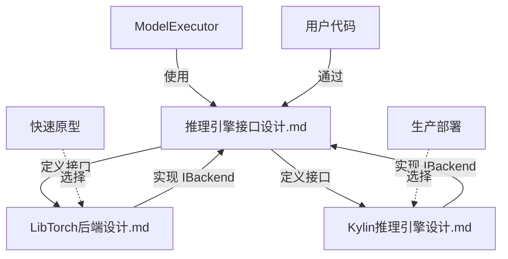

# 推理引擎文档拆分说明

## 概述

为了更清晰地组织推理引擎的设计文档，我们将原有的《自研推理引擎设计.md》拆分为三个独立的文档：

1. **推理引擎接口设计.md** - 统一接口层定义
2. **LibTorch后端设计.md** - LibTorch 后端实现细节
3. **Kylin推理引擎设计.md** - Kylin (麒麟) 自研后端实现细节

## 文档结构

```
cpp/cLLM/docs/
├── 自研推理引擎设计.md        (原文档，保留作为历史参考)
├── 推理引擎接口设计.md         (新) - 接口层
├── LibTorch后端设计.md        (新) - LibTorch 后端
└── Kylin推理引擎设计.md       (新) - Kylin 自研后端
```

## 拆分原则

### 1. 推理引擎接口设计.md

**定位**：统一接口层，定义所有后端必须遵循的接口规范

**内容包括**：
- InferenceEngine 核心接口
- IBackend 后端接口规范
- ModelConfig 模型配置
- Tensor 张量抽象
- 后端选择策略
- 使用示例
- 与 ModelExecutor 集成

**适用读者**：
- 上层模块开发者（使用推理引擎）
- 后端实现者（实现新后端）
- 架构设计者

### 2. LibTorch后端设计.md

**定位**：基于 PyTorch C++ API 的推理后端实现

**内容包括**：
- LibTorchBackend 类设计
- TorchScript 模型加载
- 输入输出转换
- 量化支持
- 性能优化（MKL-DNN/oneDNN）
- TorchScript 模型导出脚本
- 已知限制和解决方案
- 调试和诊断方法

**适用读者**：
- 使用 LibTorch 后端的开发者
- 需要快速原型验证的开发者
- GPU 推理需求的用户

### 3. Kylin推理引擎设计.md

**定位**：自研高性能推理引擎（麒麟）

**内容包括**：
- Kylin 后端架构
- Tensor 类实现
- ModelLoader（扁平 .bin 格式）
- Transformer 核心组件：
  - RMSNorm
  - RoPE
  - MultiHeadAttention
  - FeedForwardNetwork
  - TransformerBlock
  - TransformerModel
- 高性能算子（SIMD 优化）
- 量化支持
- 性能优化路线图
- 开发指南

**适用读者**：
- Kylin 后端开发者
- 性能优化工程师
- 需要极致 CPU 性能的用户

## 文档关系图



## 主要改进

### 1. 清晰的职责分离

**之前**：所有内容混在一个文档中，难以定位
**现在**：接口、LibTorch 实现、Kylin 实现完全分离

### 2. 降低学习曲线

**之前**：新手需要阅读整个文档才能理解如何使用
**现在**：
- 只需使用接口？看《推理引擎接口设计.md》
- 需要 GPU 推理？看《LibTorch后端设计.md》
- 需要极致性能？看《Kylin推理引擎设计.md》

### 3. 便于独立演进

**之前**：修改一个后端，需要同时修改整个文档
**现在**：每个后端独立文档，可以独立更新

### 4. 支持多后端架构

**设计理念**：
```
统一接口层
    │
    ├─── LibTorch Backend（快速原型）
    ├─── Kylin Backend（极致性能）
    └─── 未来扩展：ONNX、TensorRT...
```

## 命名说明

### Kylin (麒麟)

**为什么叫 Kylin？**
- **麒麟**：中国传统神兽，象征吉祥、智慧、速度
- **寓意**：
  - 🇨🇳 **中国原创**：自研引擎的标志
  - ⚡ **高性能**：追求极致速度
  - 🧠 **智慧**：优雅的设计和优化
  - 🎯 **精准**：准确的推理结果

**与项目的契合**：
- xLLM 是中文大模型推理引擎
- Kylin 作为核心引擎，体现中国原创技术
- 与 cLLM（C++ LLM）项目定位一致

## 使用指南

### 场景1：我是上层开发者，需要调用推理引擎

**推荐阅读顺序**：
1. 《推理引擎接口设计.md》- 了解如何使用接口
2. 根据需求选择后端文档

### 场景2：我需要快速验证模型

**推荐方案**：
1. 阅读《LibTorch后端设计.md》
2. 导出 TorchScript 模型
3. 使用 LibTorch 后端推理

### 场景3：我需要生产环境部署，追求极致性能

**推荐方案**：
1. 阅读《Kylin推理引擎设计.md》
2. 导出扁平 .bin 权重
3. 使用 Kylin 后端推理
4. 根据性能需求应用 SIMD 优化和量化

### 场景4：我要开发新的后端

**推荐阅读顺序**：
1. 《推理引擎接口设计.md》- 了解接口规范
2. 《LibTorch后端设计.md》或《Kylin推理引擎设计.md》- 参考现有实现
3. 实现 IBackend 接口

## 迁移指南

如果您之前使用《自研推理引擎设计.md》，现在应该：

1. **查看接口定义**：
   - 旧文档：第3节
   - 新文档：《推理引擎接口设计.md》

2. **LibTorch 相关内容**：
   - 旧文档：第3.2节
   - 新文档：《LibTorch后端设计.md》

3. **自研引擎相关内容**：
   - 旧文档：第2节、第3.1节
   - 新文档：《Kylin推理引擎设计.md》

## 文档维护

### 接口变更流程

1. 修改《推理引擎接口设计.md》
2. 同步更新《LibTorch后端设计.md》和《Kylin推理引擎设计.md》
3. 更新代码实现
4. 运行测试验证

### 后端变更流程

1. 修改对应后端文档
2. 更新代码实现
3. 运行后端测试
4. 如果影响接口，同步更新《推理引擎接口设计.md》

## 总结

通过文档拆分，我们实现了：

✅ **清晰的架构分层**：接口层 + 后端实现层  
✅ **便于理解和使用**：按需阅读，降低学习曲线  
✅ **支持多后端扩展**：LibTorch、Kylin、未来的 ONNX...  
✅ **独立演进**：每个后端可独立优化和更新  
✅ **中国原创标识**：Kylin (麒麟) 体现自研引擎特色  

**下一步**：
- 完善 Kylin 后端的 Transformer 组件实现
- 添加 SIMD 优化和量化支持
- 进行性能测试和对比
- 完善单元测试覆盖
